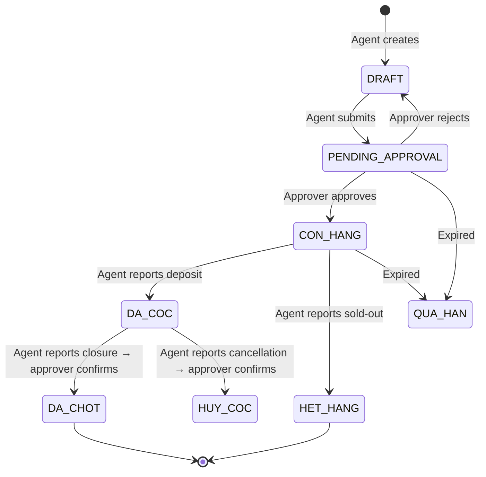

# Business Specification — Biglands

> **Project**: Biglands — B2B Internal Marketplace for CHDV Real Estate  
> **Domain**: Real Estate (Serviced Apartments / Căn Hộ Dịch Vụ)  
> **Market**: Ho Chi Minh City, Vietnam  
> **Date**: 2025-06-18  
> **Source Documents**: product-overview.md, entities-erd.md, epics/, user-flows/, screens/

---

## Table of Contents

1. [Business Glossary](#1-business-glossary)
2. [User Roles](#2-user-roles)
3. [Permissions Matrix](#3-permissions-matrix)
4. [Business Rules](#4-business-rules)
5. [Functional Requirements](#5-functional-requirements)
6. [Non-Functional Requirements](#6-non-functional-requirements)
7. [Missing Requirements](#7-missing-requirements)
8. [Ambiguous Requirements](#8-ambiguous-requirements)
9. [Contradictions Between Documents](#9-contradictions-between-documents)

---

## 1. Business Glossary

### Domain Terms

| Term | Vietnamese | Definition |
|------|-----------|------------|
| **CHDV** | Căn Hộ Dịch Vụ | Serviced apartment building — entire buildings, not individual units. The core asset type traded on the platform. |
| **Shared Cart** | Giỏ hàng chung | Centralized deal pool where all agents browse available listings, replacing fragmented Zalo/phone/spreadsheet communication. |
| **My Cart** | Giỏ hàng của tôi | Personal view of listings owned by the current user, organized by status. |
| **Product Code** | Mã hàng | Auto-generated listing identifier with format `YYMMDD` + random digits. |
| **Hot Products** | Sản phẩm HOT | Listings promoted by Admin for priority visibility with a "🔥 HOT" badge and top-of-grid placement. |
| **Pinned Listings** | Đã ghim | Per-user bookmark/watchlist for quick access to specific listings. |
| **Deposit** | Cọc / Đặt cọc | Customer payment (processed offline) to reserve a property, recorded digitally on the platform. |
| **Deal Closure** | Chốt hàng | Successful conclusion of a transaction after a confirmed deposit. |
| **Cancellation** | Huỷ cọc | Customer backs out after depositing; deposit is forfeited or refunded (offline). |
| **Sold-Out** | Hết hàng | Property is sold or fully rented without having gone through the deposit pipeline. |
| **Approval Queue** | Hàng chờ duyệt | 15 queues organized by transaction type (3) × approval stage (5) where approvers confirm or reject events. |
| **Listing Lifecycle** | Vòng đời tin đăng | State machine: DRAFT → PENDING_APPROVAL → CON_HANG → DA_COC → DA_CHOT / HUY_COC / HET_HANG. |

### Listing Statuses (Domain Values)

| Status Code | UI Label | Meaning |
|------------|----------|---------|
| `DRAFT` | Nháp | Initial state; not yet submitted for approval |
| `PENDING_APPROVAL` | Chờ duyệt | Submitted; awaiting approver decision |
| `CON_HANG` | Còn hàng | Approved and active on the shared cart |
| `DA_COC` | Đã cọc | Deposit confirmed; property is reserved |
| `DA_CHOT` | Đã chốt | Deal successfully closed; terminal state |
| `HET_HANG` | Hết hàng | Sold-out; terminal state |
| `HUY_COC` | Huỷ cọc | Deposit cancelled; terminal state |
| `QUA_HAN` | Quá hạn | Listing expired without a deal; terminal state |
| `TU_CHOI` | Từ chối | Rejected by approver; returns to DRAFT for revision |

### Transaction Types

| Code | Vietnamese | Description |
|------|-----------|-------------|
| `SANG_NHUONG` | Sang nhượng | Transfer of leasehold/business rights of an operating CHDV |
| `CHO_THUE` | Cho thuê | Rental of the entire building |
| `BAN` | Bán | Outright sale of the property |

### Property Classification Prefixes

| Prefix | Full Term | Meaning |
|--------|-----------|---------|
| **NNC** | Nhà Nguyên Căn | Entire building/house (not individual units) |
| **MT** | Mặt Tiền | Street-fronting property |
| **HXH** | Hẻm Xe Hơi | Car-accessible alley |
| **CHDV** | Căn Hộ Dịch Vụ | Serviced apartment building |

### Commission Types

| Code | Meaning |
|------|---------|
| `PERCENTAGE` | Percentage of sale/rental price (e.g., 1%, 50%) |
| `FLAT` | Fixed amount in VND (e.g., 30 triệu) |

### Event Types (DealEvent)

| Event | Description |
|-------|-------------|
| `DEPOSIT_REPORTED` | Agent reports a customer deposit |
| `DEPOSIT_CONFIRMED` | Approver confirms the deposit |
| `CLOSURE_REPORTED` | Agent reports deal closure |
| `CLOSURE_CONFIRMED` | Approver confirms deal closure |
| `CANCELLATION_REPORTED` | Agent reports deposit cancellation |
| `CANCELLATION_CONFIRMED` | Approver confirms cancellation |
| `SOLD_OUT_REPORTED` | Agent reports listing as sold-out |
| `SOLD_OUT_CONFIRMED` | Approver confirms sold-out |

### Approval Types

| Type | Description |
|------|-------------|
| `LISTING_POST` | Approval of a new listing submission |
| `DEPOSIT` | Approval of a deposit report |
| `CANCELLATION` | Approval of a cancellation report |
| `CLOSURE` | Approval of a deal closure report |
| `SOLD_OUT` | Approval of a sold-out report |

---

## 2. User Roles

### Role: Agent

**Description**: Sales agents and brokers dealing in CHDV properties. Primary users who list properties, discover deals, and transact.

**Capabilities**:
- Browse shared cart (full listing grid, search, filter)
- View product detail pages
- Pin/unpin listings to personal watchlist
- Create new listings (enters DRAFT)
- Edit own listings (status-dependent)
- Delete own DRAFT listings
- Withdraw own ACTIVE listings (returns to DRAFT)
- Report deposit, closure, cancellation, or sold-out on ANY listing (not just own)
- View notifications scoped to own activity
- Access only 3 sidebar items: Shared Cart, My Cart, Notifications

**Restrictions**:
- Cannot approve/reject any event
- Cannot manage users
- Cannot manage hot products
- Cannot edit another agent's listings
- Cannot access `/admin/*` routes

---

### Role: Approver

**Description**: Team leaders / brokerage managers who verify listing data and deal events before they take effect.

**Capabilities**:
- All Agent capabilities
- View and act on all 15 approval queues per transaction type and stage
- Approve or reject listings, deposits, cancellations, closures, and sold-out reports
- Bulk-approve listing posts
- Enter rejection reasons (required for rejection)

**Restrictions**:
- Cannot manage users
- Cannot manage hot products
- Cannot delete listings

---

### Role: Admin

**Description**: System administrators and operations staff who manage the platform.

**Capabilities**:
- All Approver capabilities
- Create, edit, deactivate/reactivate user accounts
- Assign/change user roles
- Promote/demote listings to/from Hot status
- Reorder hot products
- See all system-wide notifications
- Full sidebar with all 15 approval queues plus management links

**Restrictions**:
- Cannot deactivate own account
- Cannot remove the last ADMIN role
- Cannot delete users (soft-deactivate only)

---

### Role: Unauthenticated Viewer

**Description**: Users who have not logged in. Severely restricted.

**Capabilities**:
- View login page only
- Redirected to login when accessing any protected route

---

## 3. Permissions Matrix

| Feature / Action | Unauthenticated | Agent | Approver | Admin |
|---|---|---|---|---|
| **Authentication** | | | | |
| Log in | Yes | — | — | — |
| Log out | — | Yes | Yes | Yes |
| **Browsing** | | | | |
| View shared cart (homepage) | Redirect to login | Yes | Yes | Yes |
| View product detail | Redirect to login | Yes | Yes | Yes |
| Search listings | Redirect to login | Yes | Yes | Yes |
| Filter by All/Pinned/Hot | Redirect to login | Yes | Yes | Yes |
| Pin/unpin listing | Redirect to login | Yes | Yes | Yes |
| View My Cart | Redirect to login | Yes | Yes | Yes |
| **Listing Management** | | | | |
| Create listing | Redirect to login | Yes | Yes | Yes |
| Edit own listing (DRAFT) | — | Yes | Yes | Yes |
| Edit own listing (ACTIVE) | — | Yes (triggers re-approval) | Yes | Yes |
| Edit another agent's listing | — | No | No | No |
| Delete own DRAFT listing | — | Yes | No | No |
| Withdraw own ACTIVE listing | — | Yes | Yes | Yes |
| **Deal Operations (any listing)** | | | | |
| Report deposit | — | Yes | Yes | Yes |
| Report closure | — | Yes | Yes | Yes |
| Report cancellation | — | Yes | Yes | Yes |
| Report sold-out | — | Yes | Yes | Yes |
| **Approval** | | | | |
| View approval queues | — | No | Yes | Yes |
| Approve listing post | — | No | Yes | Yes |
| Approve deposit | — | No | Yes | Yes |
| Approve closure | — | No | Yes | Yes |
| Approve cancellation | — | No | Yes | Yes |
| Approve sold-out | — | No | Yes | Yes |
| Reject (with reason) | — | No | Yes | Yes |
| Bulk approve | — | No | Yes | Yes |
| **User Management** | | | | |
| View user list | — | No | No | Yes |
| Create user | — | No | No | Yes |
| Edit user | — | No | No | Yes |
| Change user role | — | No | No | Yes |
| Deactivate/reactivate user | — | No | No | Yes |
| **Hot Products** | | | | |
| View hot list management | — | No | No | Yes |
| Add/remove hot listing | — | No | No | Yes |
| Reorder hot listings | — | No | No | Yes |
| **Notifications** | | | | |
| View notifications | — | Yes (scoped) | Yes (scoped) | Yes (all) |
| Mark as read | — | Yes | Yes | Yes |
| Mark all as read | — | Yes | Yes | Yes |
| **Access Control** | | | | |
| View sidebar (full) | — | No (3 items) | Via accordion | Yes |
| Access `/admin/*` | — | No (403) | No (403) | Yes |

---

## 4. Business Rules

### 4.1 Listing Rules

| ID | Rule | Source |
|----|------|--------|
| BR-001 | A listing can only have one active deposit at a time. | entities-erd.md, deposit-deal-lifecycle |
| BR-002 | Cancellation can only be reported after a deposit has been reported/confirmed. | entities-erd.md |
| BR-003 | Closure can only be reported after a deposit has been reported/confirmed. | entities-erd.md |
| BR-004 | Any agent can report deposit, closure, cancellation, or sold-out on any listing (not just their own). Only the listing owner can edit listing info. | entities-erd.md |
| BR-005 | Only an APPROVER or ADMIN can confirm approval/rejection decisions. | entities-erd.md |
| BR-006 | A rejected listing returns to DRAFT status for revision; rejection must include a reason. | entities-erd.md, approval-workflow |
| BR-007 | A listing must have at least one image before submission for approval. | entities-erd.md |
| BR-008 | Commission must be specified for all transaction types (SANG_NHUONG, CHO_THUE, BAN). | entities-erd.md (NB: contradicts epic listing-management BR-008) |
| BR-009 | Hot listings appear at the top of the listing grid with a "🔥 HOT" badge. | entities-erd.md |
| BR-010 | Notifications are role-scoped: agents see only relevant notifications; admins see all system-wide notifications. | entities-erd.md |
| BR-011 | Commission can be either a percentage (%) or fixed amount (VNĐ). | entities-erd.md |
| BR-012 | Product code is auto-generated in format YYMMDD + random digits. | entities-erd.md |
| BR-013 | Location uses a 3-level cascade: City → District → Ward (Ward disabled until District selected). | entities-erd.md |
| BR-014 | A listing can have up to 20 images and 1 YouTube video. | entities-erd.md |
| BR-015 | The global listing counter shows the total count of active listings across all transaction types. | entities-erd.md |

### 4.2 Listing Visibility Rules

| ID | Rule | Source |
|----|------|--------|
| LV-001 | Listings with status ACTIVE (CON_HANG) or DEPOSITED (DA_COC) are visible in shared cart. | shared-cart-browsing |
| LV-002 | SOLD_OUT (HET_HANG), CLOSED (DA_CHOT), and CANCELLED (HUY_COC) listings are hidden from shared cart. | shared-cart-browsing |
| LV-003 | Pinning is a per-user preference, not a global state. | shared-cart-browsing |
| LV-004 | Listing detail page is viewable by all authenticated users regardless of role. | shared-cart-browsing US-004 |

### 4.3 Deposit & Deal Rules

| ID | Rule | Source |
|----|------|--------|
| DD-001 | A deposit report requires customer name (≥2 characters), phone, and deposit amount (>0). | deposit-deal-lifecycle US-001 |
| DD-002 | A deposit can only be reported when listing status is ACTIVE (CON_HANG). | deposit-deal-lifecycle US-001 |
| DD-003 | Deal closure can only be reported when listing status is DEPOSITED (deposit confirmed). | deposit-deal-lifecycle US-003 |
| DD-004 | Cancellation can only be reported when listing status is DEPOSITED. | deposit-deal-lifecycle US-004 |
| DD-005 | Cancellation reason is required. | deposit-deal-lifecycle US-004 |
| DD-006 | Sold-out can only be reported when listing status is ACTIVE. | deposit-deal-lifecycle US-006 |

### 4.4 Approval Rules

| ID | Rule | Source |
|----|------|--------|
| AP-001 | Listing must be in the correct status for each approval stage. | approval-workflow |
| AP-002 | Rejection must include a reason. | approval-workflow |
| AP-003 | Rejection of a listing post returns the listing to DRAFT status. | approval-workflow US-002 |
| AP-004 | Listing approval makes status ACTIVE (CON_HANG). | approval-workflow US-001 |
| AP-005 | Deposit approval makes listing status DEPOSITED (DA_COC). | deposit-deal-lifecycle US-002 |
| AP-006 | Deposit rejection returns listing to ACTIVE (CON_HANG). | deposit-deal-lifecycle US-002 |
| AP-007 | Closure approval makes listing status CLOSED (DA_CHOT). | deal-closure-pipeline |
| AP-008 | Closure rejection leaves listing as DEPOSITED. | deal-closure-pipeline |
| AP-009 | Cancellation approval makes listing status ACTIVE (listing returns to pool). | deposit-deal-lifecycle US-005 |
| AP-010 | Cancellation rejection leaves listing as DEPOSITED. | cancellation-pipeline |
| AP-011 | Sold-out approval makes listing status SOLD_OUT (HET_HANG). | sold-out-pipeline |
| AP-012 | Sold-out rejection leaves listing as ACTIVE. | sold-out-pipeline |

### 4.5 User Management Rules

| ID | Rule | Source |
|----|------|--------|
| UM-001 | Admin cannot deactivate their own account. | user-management epic |
| UM-002 | At least one ADMIN must always exist on the platform. | user-management epic |
| UM-003 | Cannot change the role of the last ADMIN. | user-management US-004 |
| UM-004 | Deactivated users cannot log in. | user-management epic |
| UM-005 | Deactivated users' existing listings remain visible but they cannot create new ones. | user-management US-003 |
| UM-006 | Self-registration is not supported; all accounts are created by an Admin. | user-management epic (out of scope) |

### 4.6 Notification Rules

| ID | Rule | Source |
|----|------|--------|
| NT-001 | Approvers receive notifications when agents report deposits/closure/cancellation/sold-out. | notification-system US-001 |
| NT-002 | Agents receive notifications when their listings are approved/rejected and when deposits/closure/cancellation/sold-out are confirmed. | notification-system US-001 |
| NT-003 | Notifications are created automatically on key events. | notification-system US-001 |
| NT-004 | Users can mark individual or all notifications as read. | notification-system US-002 |

### 4.7 Edit & Status Change Rules

| ID | Rule | Source |
|----|------|--------|
| ES-001 | Agents can edit own listings in DRAFT status without re-approval. | listing-management US-002 |
| ES-002 | Editing key fields (price, area, images) on an ACTIVE listing returns it to PENDING_APPROVAL. | listing-management US-002 |
| ES-003 | DRAFT listings can be permanently deleted. | listing-management US-003 |
| ES-004 | ACTIVE listings can be withdrawn (returned to DRAFT) by the owner. | listing-management US-003 |

### 4.8 Hot Products Rules

| ID | Rule | Source |
|----|------|--------|
| HP-001 | Only Admin can promote/demote listings to/from Hot status. | hot-products epic |
| HP-002 | Only ACTIVE listings can be promoted to Hot. | hot-products US-001 |
| HP-003 | Hot listings can be reordered (drag-and-drop). | hot-products US-002 |
| HP-004 | Maximum number of hot items: 14 (observed). | user-flows FL-012 |
| HP-005 | Hot listings appear in a dedicated horizontal scrollable strip above the main listing grid. | screens SC-002 |

### 4.9 Display & UI Rules

| ID | Rule | Source |
|----|------|--------|
| UI-001 | Sidebar access is role-dependent: Agents see 3 items; Admins see full sidebar with accordion menus. | product-overview |
| UI-002 | Admin-only routes (`/admin/*`) return "Bạn không có quyền truy cập trang này" for non-admin users. | screens SC-002 |
| UI-003 | My Cart shows 4 tabs for Agents (Đã đăng, Chờ duyệt, Từ chối, Quá hạn) and 2 tabs for Admins (Đã đăng, Quá hạn). | screens SC-006 |
| UI-004 | Page title shows "Đăng nhập quản lý" on the login page and "Biglands" on all authenticated pages. | user-flows FL-001 |
| UI-005 | Listing cards show: cover image, title, price, commission, address, area, rooms/bathrooms/floors, agent name, date, status badge, tags. | screens SC-002 |
| UI-006 | Notifications display in reverse-chronological order with relative timestamps. | user-flows FL-014 |

---

## 5. Functional Requirements

### FR-01: Authentication (Must Have)

**FR-01.1** The system shall allow users to log in with username and password.  
**FR-01.2** The system shall redirect unauthenticated users to `/dang-nhap` when accessing protected routes.  
**FR-01.3** The system shall display an error message for invalid credentials.  
**FR-01.4** The system shall prevent deactivated users from logging in.  
**FR-01.5** The system shall redirect already authenticated users away from the login page.  
**FR-01.6** The system shall support a "Forgot password?" link (UI only; actual reset is handled by Admin).  

### FR-02: Shared Cart Browsing (Must Have)

**FR-02.1** The system shall display a paginated grid of listing cards on the homepage.  
**FR-02.2** The system shall show the total count of active listings.  
**FR-02.3** The system shall sort listings by recency (newest first).  
**FR-02.4** The system shall show an empty state when no listings are available.  
**FR-02.5** The system shall support pagination with Previous/Next buttons and page numbers.  
**FR-02.6** The system shall display a horizontal scrollable "Hot Products" section above the main grid.  

### FR-03: Search (Must Have)

**FR-03.1** The system shall search listings by keyword across product code, title, description, address, ward, and district.  
**FR-03.2** The system shall update results in real-time as the user types.  
**FR-03.3** The system shall show an empty results message with the search term when no matches are found.  
**FR-03.4** The system shall sanitize special characters in search input.  

### FR-04: Filtering (Should Have)

**FR-04.1** The system shall provide three filter tabs: "Tất cả loại hàng" (All), "Đã ghim" (Pinned), "Hàng Hot" (Hot).  
**FR-04.2** Each filter tab shall display the count of listings in that category.  
**FR-04.3** The system shall show an empty state when a filter yields no results.  

### FR-05: Pin/Unpin Listings (Should Have)

**FR-05.1** The system shall allow any authenticated user to toggle pin status on any listing.  
**FR-05.2** Pinning shall be per-user (not global).  
**FR-05.3** The pin icon shall visually indicate pinned vs unpinned state.  

### FR-06: Product Detail (Must Have)

**FR-06.1** The system shall display a full product detail page at `/san-pham/:id`.  
**FR-06.2** The page shall include: image gallery with navigation, price, commission, area, rooms, bathrooms, floors, address, description, agent info.  
**FR-06.3** The page shall show deal action buttons (report deposit, sold-out, closure, cancellation) with context-dependent enable/disable states.  
**FR-06.4** The page shall show an "Edit" button only for the listing owner.  
**FR-06.5** The page shall include a "Reviews & Ratings" section with text input and image upload.  

### FR-07: Create Listing (Must Have)

**FR-07.1** The system shall provide a listing creation form at `/gio-hang/tao`.  
**FR-07.2** The form shall include: title, transaction type, property type, commission, location cascade (city/district/ward), street address, price, owner phone, property dimensions, optional attributes, description, images, and YouTube video link.  
**FR-07.3** The system shall auto-generate a product code (YYMMDD + random digits) upon creation.  
**FR-07.4** The system shall save the listing as DRAFT on "Save" or PENDING_APPROVAL on "Submit for Approval".  
**FR-07.5** The system shall validate all required fields on submission: price, area dimensions, address, commission, description, at least one image.  
**FR-07.6** The system shall enforce the location cascade: District populated based on City; Ward disabled until District selected.  

### FR-08: Edit Listing (Must Have)

**FR-08.1** The system shall allow listing owners to edit their own listings at `/gio-hang/:id/chinh-sua`.  
**FR-08.2** The form shall be pre-filled with existing listing data.  
**FR-08.3** Editing a DRAFT listing shall save changes without re-approval.  
**FR-08.4** Editing key fields (price, area, images) on an ACTIVE listing shall return it to PENDING_APPROVAL.  
**FR-08.5** The system shall prevent non-owners from seeing the Edit button.  

### FR-09: Manage Listing Status (Should Have)

**FR-09.1** The system shall allow the listing owner to delete DRAFT listings (permanent removal).  
**FR-09.2** The system shall allow the listing owner to withdraw ACTIVE listings (return to DRAFT).  

### FR-10: Report Deposit (Must Have)

**FR-10.1** The system shall allow any authenticated user to report a deposit on any listing when status is ACTIVE.  
**FR-10.2** The deposit form shall collect: customer name, customer phone, deposit amount, optional notes.  
**FR-10.3** The system shall validate: customer name (≥2 characters), deposit amount (>0).  
**FR-10.4** The system shall prevent multiple active deposits on the same listing (BR-001).  

### FR-11: Approve Deposit (Must Have)

**FR-11.1** The system shall show pending deposit reports in the deposit approval queue.  
**FR-11.2** Approvers/Admins can confirm or reject a deposit.  
**FR-11.3** Confirmation shall change listing status to DEPOSITED.  
**FR-11.4** Rejection shall return status to ACTIVE; reason is recommended.  

### FR-12: Report Deal Closure (Should Have)

**FR-12.1** The system shall allow reporting deal closure only when listing status is DEPOSITED.  
**FR-12.2** Closure report creates a CLOSURE_REPORTED event pending approval.  
**FR-12.3** The closure button shall be disabled/hidden when listing is not DEPOSITED.  

### FR-13: Report Cancellation (Should Have)

**FR-13.1** The system shall allow reporting cancellation only when listing status is DEPOSITED.  
**FR-13.2** Cancellation reason is required.  

### FR-14: Approve Cancellation (Should Have)

**FR-14.1** Approvers/Admins can confirm or reject a cancellation report.  
**FR-14.2** Confirmation returns listing to ACTIVE status.  

### FR-15: Report Sold-Out (Must Have)

**FR-15.1** The system shall allow reporting sold-out only when listing status is ACTIVE.  
**FR-15.2** A confirmation step is required before submission.  

### FR-16: Approval Queue (Must Have)

**FR-16.1** The system shall provide 15 approval queues: 3 transaction types × 5 stages (post, deposit, cancellation, closure, sold-out).  
**FR-16.2** Each queue shall display listing cards with relevant details and action buttons.  
**FR-16.3** Pending count badges shall appear in the sidebar navigation.  
**FR-16.4** Approve/Reject actions shall require confirmation.  
**FR-16.5** Rejection shall require a reason.  
**FR-16.6** The system shall support bulk approval for listing posts only.  
**FR-16.7** The system shall handle concurrent approval attempts gracefully (first succeeds, others see "Already processed").  

### FR-17: User Management (Must Have)

**FR-17.1** Admin can create users with fields: full name, username, phone (optional), role.  
**FR-17.2** Username must be unique.  
**FR-17.3** An initial password is generated at account creation.  
**FR-17.4** Admin can edit user: full name, username, phone, role, active/inactive status.  
**FR-17.5** Admin can deactivate/reactivate users with confirmation dialog.  
**FR-17.6** Admin can change user roles among AGENT, APPROVER, ADMIN.  
**FR-17.7** Admin cannot deactivate own account or change own role (if last ADMIN).  
**FR-17.8** The user list supports search by name, username, or phone and includes pagination.  

### FR-18: Hot Products Management (Should Have)

**FR-18.1** Admin can view a list of all hot listings at `/admin/san-pham-hot`.  
**FR-18.2** Admin can add listings to hot by searching and selecting.  
**FR-18.3** Admin can remove listings from hot.  
**FR-18.4** Admin can reorder hot listings via drag-and-drop.  
**FR-18.5** Maximum hot items is enforced (observed: 14).  

### FR-19: Notifications (Must Have)

**FR-19.1** The system shall create notifications automatically on these events: listing approved/rejected, deposit reported/confirmed, deal closed, cancellation confirmed, sold-out confirmed.  
**FR-19.2** Agents see notifications scoped to their listings and activity.  
**FR-19.3** Admins see all system-wide notifications.  
**FR-19.4** The notification bell icon shall display an unread count badge.  
**FR-19.5** The notification list page (`/thong-bao`) shall support filter tabs: All / Unread and category filters by transaction type.  
**FR-19.6** Users can mark individual notifications as read (via click) or all as read.  
**FR-19.7** Notifications shall be displayed in reverse-chronological order with relative timestamps.  
**FR-19.8** Clicking a notification shall navigate to the related listing detail page.  

### FR-20: Reviews & Ratings (Unsourced — See Missing Requirements)

**FR-20.1** The product detail page includes a "Nhận xét & Đánh giá" section with text input.  
**FR-20.2** Users can submit reviews with text and up to 10 images.  
**FR-20.3** Empty state shows "Chưa có nhận xét nào".  

---

## 6. Non-Functional Requirements

### NFR-01: Performance

| ID | Requirement |
|----|-------------|
| NFR-01.1 | The listing grid page shall load within 3 seconds under normal network conditions. |
| NFR-01.2 | Search results shall update within 1 second of user input. |
| NFR-01.3 | The system shall handle at least 100 concurrent users without significant degradation. |
| NFR-01.4 | Pagination shall support at least 10,000 listings without excessive load times. |
| NFR-01.5 | Image uploads shall not block form submission (async upload). |

### NFR-02: Security

| ID | Requirement |
|----|-------------|
| NFR-02.1 | All authenticated routes shall validate the user's session token. |
| NFR-02.2 | Passwords shall be stored as hashed values (never plaintext). |
| NFR-02.3 | Role-based access control shall be enforced on both frontend (UI) and backend (API). |
| NFR-02.4 | Admin-only routes shall return HTTP 403 for non-admin users. |
| NFR-02.5 | Search input shall be sanitized against injection attacks. |
| NFR-02.6 | Concurrent approval requests shall be handled with optimistic locking or equivalent to prevent double-processing. |

### NFR-03: Availability & Reliability

| ID | Requirement |
|----|-------------|
| NFR-03.1 | The system shall target 99.5% uptime during business hours. |
| NFR-03.2 | Submitted form data shall be preserved on server error (form state recovery). |
| NFR-03.3 | The system shall display appropriate loading states and error messages during network failures. |

### NFR-04: Usability

| ID | Requirement |
|----|-------------|
| NFR-04.1 | The UI shall be in Vietnamese (primary language). |
| NFR-04.2 | All form fields shall have clear validation error messages inline. |
| NFR-04.3 | Deal action buttons shall be enabled/disabled based on listing status context. |
| NFR-04.4 | The sidebar shall show unread notification counts and pending approval counts. |
| NFR-04.5 | The login page shall show different branding ("Đăng nhập quản lý") than the main app ("Biglands"). |
| NFR-04.6 | Notifications shall use relative timestamps in Vietnamese ("vài giây trước", "N giờ trước", "N ngày trước"). |

### NFR-05: Data Integrity

| ID | Requirement |
|----|-------------|
| NFR-05.1 | All listing lifecycle status changes shall be recorded as DealEvents for audit trail. |
| NFR-05.2 | All approval/rejection decisions shall be recorded as Approval entities. |
| NFR-05.3 | Product codes shall be unique and auto-generated. |
| NFR-05.4 | A listing shall never have more than one active deposit at any time (enforced at database level). |
| NFR-05.5 | Status transitions shall follow the defined state machine; invalid transitions shall be rejected. |

### NFR-06: Maintainability

| ID | Requirement |
|----|-------------|
| NFR-06.1 | Approval queue implementation shall use a generic template applied to all 15 queues. |
| NFR-06.2 | Business rules shall be configurable (not hard-coded) where feasible. |
| NFR-06.3 | Entity models shall follow the documented ERD structure. |

---

## 7. Missing Requirements

The following requirements are implied by the documents or observed in screen specs but are **not explicitly defined** as stories, epics, or business rules.

### MR-01: Reviews & Ratings Feature

**Evidence**: SC-003 Product Detail describes a "Nhận xét & Đánh giá" section with text input, image upload (max 10 images), and a submit button.  
**Gap**: No user story, epic, or business rule defines:
- Who can write reviews (any authenticated user? only agents?).
- Whether reviews require approval/moderation.
- Whether ratings are numerical or text-only.
- Whether reviews are tied to listings or to agents.
- How review images are stored and moderated.

**Recommendation**: Define a story under a new or existing epic covering review submission, moderation (if any), and display.

### MR-02: Owner Phone Display

**Evidence**: SC-003 Product Detail mentions "Số điện thoại chủ nhà" (owner phone) hidden behind an icon.  
**Gap**: No explicit requirements or acceptance criteria define:
- Who can view the owner phone (all agents? only the listing owner?).
- The privacy/access control mechanism.
- Whether this field is the same as "ownerPhone" from the create listing form.

**Recommendation**: Define access control rules for owner phone visibility.

### MR-03: Listing Expiration (QUA_HAN)

**Evidence**: The status state machine includes `QUA_HAN` (expired) as a terminal state reachable from `PENDING_APPROVAL` or `CON_HANG`.  
**Gap**: No requirements define:
- The expiration period (how long before a listing expires).
- How the system triggers expiration (scheduled job? manual?).
- Notification to agents when their listing approaches/expires.
- Whether expired listings can be renewed or require re-creation.

**Recommendation**: Define a scheduled expiration mechanism with configurable duration and notifications.

### MR-04: "My Cart" Detail Page

**Evidence**: SC-006 My Cart references own listing detail at `/gio-hang/:id`, distinct from the shared cart product detail at `/san-pham/:id`.  
**Gap**: No screen spec or story defines what the My Cart detail page contains or how it differs from the public product detail page (e.g., does it show edit actions? status management?).

**Recommendation**: Define a screen spec for the My Cart detail view.

### MR-05: Image Management in Edit Flow

**Evidence**: SC-005 Edit Listing references "add/remove/reorder" images. The create listing form defines a max of 20 images.  
**Gap**: No explicit requirements for:
- Adding new images during edit.
- Removing existing images during edit.
- Reordering images and changing the primary image.
- Whether image changes on an ACTIVE listing trigger re-approval.

**Recommendation**: Define image management behaviors in the edit listing flow.

### MR-06: Transaction Type "Loại" (Property Type) Combobox

**Evidence**: SC-004 Create Listing includes a "Loại" (Property Type) combobox that is "empty until selection made".  
**Gap**: No specification defines what options appear in this combobox or how it relates to the main transaction type (BÁN/CHO THUÊ/SANG NHƯỢNG).

**Resolution**: Ten values defined: `NHA_PHO`, `CAN_HO`, `CHDV`, `DAT`, `BIET_THU`, `VAN_PHONG`, `MAT_BANG`, `KHO_XUONG`, `NHA_TRO`, `KHAC`. Added to domain model (Listing.propertyType) and API (PropertyType enum + all listing schemas). Dependency on transaction type and relationship to title prefix remain unresolved — see AR-01 and AR-02.

### MR-07: Offline Processes

**Evidence**: The deposit and commission processing are explicitly out of scope (offline).  
**Gap**: No guidance on:
- How offline deposit payments are verified before an approver confirms.
- When/how commissions are paid out.
- How disputes over deposits or commissions are resolved.

**Recommendation**: Add operational notes documenting the manual workflows that surround the digital system.

### MR-08: Audit Log & History

**Evidence**: Approval entities and DealEvents serve as audit trail, but there is no explicit requirement for a consolidated audit log view.  
**Gap**: No screen or story for viewing a listing's full history (status changes, approvals, deposits, closures) in one place.

**Recommendation**: Consider adding a "History" tab or timeline view on the product detail page.

### MR-09: Notification Preferences

**Evidence**: US-003-notification-preferences exists but is marked as "Could Have" and the epic declares notification preferences "Out of Scope".  
**Gap**: The story exists but the epic contradicts it. Resolution needed (see Contradictions).

### MR-10: Multi-language / Internationalization

**Evidence**: All UI text is in Vietnamese.  
**Gap**: No requirement addresses whether the platform should support English or other languages.

### MR-11: Logout Behavior

**Evidence**: SC-003 mentions user avatar + name dropdown with "Đăng xuất" (Logout).  
**Gap**: No explicit acceptance criteria for logout behavior.

### MR-12: Data Export

**Evidence**: No requirement exists.  
**Gap**: Agents or admins may need to export listing data, deal reports, or commission summaries.

---

## 8. Ambiguous Requirements

### AR-01: "Listing is in correct status for each approval stage" (AP-001)

**Issue**: The rule says a listing must be in the correct status, but does not define exactly which statuses map to which approval queues.  
**Clarification Needed**:

| Approval Type | Required Listing Status |
|---------------|------------------------|
| LISTING_POST | PENDING_APPROVAL |
| DEPOSIT | ACTIVE (deposit reported, not yet confirmed) |
| CLOSURE | DEPOSITED |
| CANCELLATION | DEPOSITED |
| SOLD_OUT | ACTIVE |

### AR-02: Agent vs Listing Owner in Deal Operations

**Issue**: BR-004 says "Any agent can report deposit/closure/cancellation/sold-out on any listing." However, FL-005, FL-008, FL-009, and FL-010 preconditions state "User is logged in as the listing owner."  
**Clarification Needed**: Is the precondition requirement strictly "logged in as Agent" (any agent) or "logged in as the listing owner"? Documents contradict.

### AR-03: "Edit key fields triggers re-approval"

**Issue**: US-002-edit-listing says "key fields (price, area, images)" trigger re-approval. It is unclear whether other fields (address, description, rooms, etc.) can be changed without triggering re-approval.  
**Clarification Needed**: Define the complete list of fields that require re-approval vs. fields that update in-place on ACTIVE listings.

### AR-04: Transaction type lock on Edit

**Issue**: SC-005 Edit Listing says "Transaction type (locked after submission?)" — the question mark indicates uncertainty.  
**Clarification Needed**: Can the transaction type of a listing be changed after creation?

### AR-05: "Save as Draft" vs "Submit for Approval"

**Issue**: SC-004 Create Listing shows only "Hủy" (Cancel) and "Đăng tải" (Post/Submit) buttons. But user-flow FL-003 and US-001-create-listing reference two distinct actions: "Save as Draft" and "Submit for Approval."  
**Clarification Needed**: Does the create form have one or two submission buttons? If two, what is the exact label and behavior of each?

### AR-06: Max Hot Items

**Issue**: FL-012 references "14 hot items max" as an observed value. No explicit business rule defines this as a hard limit.  
**Clarification Needed**: Is 14 the official maximum, a configurable parameter, or just an observed value based on current data?

### AR-07: Notifications for Approvers

**Issue**: BR-010 says "agents see only relevant notifications, admins see all." It does not specify what Approvers see.  
**Clarification Needed**: Do Approvers see only notifications related to the transaction types/queues they are responsible for, or all notifications like Admins?

### AR-08: Bulk Approve Scope

**Issue**: US-003-bulk-approve exists only for "listing posts." It is unclear whether bulk approve applies to deposit/cancellation/closure/sold-out queues.  
**Clarification Needed**: Confirm bulk approval is listing-post only.

### AR-09: Forgot Password Flow

**Issue**: FL-001 says "Forgot password: not implemented in current scope — rely on admin reset." However, SC-001 Login includes a "Quên mật khẩu?" link.  
**Clarification Needed**: Should the link be visible but non-functional (informational only), or should it trigger an admin notification?

### AR-10: Draft Auto-Save

**Issue**: FL-003 notes "draft may be auto-saved or discarded" when user cancels/navigates away.  
**Clarification Needed**: Is auto-save implemented or not?

### AR-11: Review Image Limit

**Issue**: SC-003 mentions max 10 images for reviews. No story defines this.  
**Clarification Needed**: Is 10 the official max for review images? How does it compare to the listing image limit of 20?

### AR-12: YouTube Video Format

**Issue**: SC-004 says the video field accepts a YouTube link with placeholder `https://www.youtube.com/watch?v=RzVvThhjAKw`.  
**Clarification Needed**: Are other video platforms supported? What about short URLs (youtu.be)? Is the video embedded or just a link?

### AR-13: Role Display in User List

**Issue**: SC-009 says role column displays organization/team names like "MQ Land", "ID Land" — not the AGENT/APPROVER/ADMIN enum values from the entity definitions.  
**Clarification Needed**: Is the role display mapped to organizations? Is the Role enum separate from an organizational group/team concept? Do users belong to organizations?

### AR-14: Concurrent Deposit Reporting

**Issue**: US-001-report-deposit handles "another agent already reported" case, but the mechanism is unclear.  
**Clarification Needed**: Is the check on submit only, or is the deposit action button disabled/hidden when a deposit is already pending?

---

## 9. Contradictions Between Documents

### C-01: Commission Required for Which Transaction Types

| Source | Statement |
|--------|-----------|
| **entities-erd.md BR-008** | "Commission must be specified for all transaction types (SANG_NHUONG, CHO_THUE, BAN)." |
| **epics/listing-management BR-008** | "Commission is required for SANG_NHUONG and BAN transaction types." |

**Contradiction**: One source says ALL types require commission; the other excludes CHO_THUE.  
**Resolution Needed**: Confirm whether CHO_THUE requires commission specification.

### C-02: Deposit Report Status Change

| Source | Statement |
|--------|-----------|
| **US-001-report-deposit** (Acceptance Criteria) | "The listing status changes to DEPOSITED (pending approval)" |
| **FL-005-report-deposit** (Flow) | "Status unchanged (pending approval)" |

**Contradiction**: The user story says status changes to DEPOSITED immediately upon report; the user flow says status remains unchanged until approval.  
**Resolution Needed**: Define whether reporting a deposit changes status immediately or only after approval.

### C-03: Deal Action Permission — Any Agent vs Listing Owner

| Source | Statement |
|--------|-----------|
| **BR-004** (entities-erd, deposit-deal-lifecycle) | "Any agent can report deposit, closure, cancellation, or sold-out on any listing." |
| **FL-005, FL-008, FL-009, FL-010** (Preconditions) | "User is logged in as the listing owner" |

**Contradiction**: Business rules explicitly permit any agent; user flow preconditions restrict to listing owner.  
**Resolution**: BR-004 (any agent) takes precedence. Product-overview.md confirms "report deposit/sold-out/closure/cancellation on ANY listing (not just own)." Updated in architecture.md §12.2.

### C-04: Notification Preferences — In Scope vs Out of Scope

| Source | Statement |
|--------|-----------|
| **epics/notification-system** (Out of Scope) | "Notification preferences" is listed as out of scope. |
| **US-003-notification-preferences** | Exists as a "Could Have" story defining preference toggles. |

**Contradiction**: The epic declares it out of scope, but a user story exists for it.  
**Resolution Needed**: Decide whether notification preferences are in or out of scope.

### C-05: Number of Sidebar Items for Agent

| Source | Statement |
|--------|-----------|
| **product-overview.md** | "Agent access only 3 sidebar items" |
| **SC-002-shared-cart-home** (Sidebar) | Agent sidebar lists 3 items: Shared Cart, My Cart, Notifications |

**Consistent** — No contradiction here. However, the Admin sidebar description in product-overview says "full sidebar with 15 approval queues" which is slightly misleading: the sidebar has 3 accordion menus (transaction types) × 5 links each, plus additional admin links.

### C-06: Location Fields Required?

| Source | Statement |
|--------|-----------|
| **SC-004-create-listing** | Street name, house number marked as required (*). |
| **entities-erd.md** | address is String (Yes — required), but no separate street/house fields. ward, district, city are all required. |

**Resolution Needed**: Clarify whether address is one combined field or broken into street + house number + ward + district + city. The create form suggests 5 separate fields; the entity suggests 4 (address as single string + ward + district + city).

### C-07: Commission Field Required?

| Source | Statement |
|--------|-----------|
| **entities-erd.md** | commissionType and commissionValue are "No" (optional). |
| **BR-008** (entities-erd) | "Commission must be specified for all transaction types." |
| **SC-004-create-listing** | "Hoa hồng (*)" marked as required. |

**Contradiction**: Entity definition says optional; business rule says required.  
**Resolution Needed**: The business rule should take precedence. Update entity definition to make commission fields required.

### C-08: Image Required — Client-Side vs Server-Side

| Source | Statement |
|--------|-----------|
| **SC-004-create-listing** (Validation) | "At least one image recommended (enforced server-side for submission)" |
| **BR-007 / US-001-create-listing** | "At least one image is required before submission" |

**Contradiction**: Screen spec says "recommended" (soft requirement); business rule says "required" (hard requirement).  
**Resolution Needed**: Confirm whether image is strictly required or just recommended.

### C-09: Listing Status After Deposit Report

| Source | Statement |
|--------|-----------|
| **US-001-report-deposit** | Status changes to "DEPOSITED (pending approval)" |
| **State Machine (entities-erd)** | The state machine shows a direct transition: CON_HANG → (Agent reports deposit) → DA_COC. No intermediate "pending" state is shown. |

**Contradiction**: The user story implies an intermediate pending state after deposit report; the state machine shows an immediate transition to DA_COC.  
**Resolution Needed**: Define whether there is a "DEPOSIT_PENDING" intermediate status or if the deposit report and confirmation are atomic.

### C-10: Page Title Branding

| Source | Statement |
|--------|-----------|
| **FL-001-authentication** | "Page title shows 'Đăng nhập quản lý' on the login page, but 'Biglands' on all other pages after authentication" |
| **SC-001-login** | Page title: "Đăng nhập quản lý" only (consistent) |

**Consistent** — No contradiction, documented here for completeness.

### C-11: Admin Can Create Listings?

| Source | Statement |
|--------|-----------|
| **FL-003-create-listing** (Preconditions) | "User is logged in as Agent, Approver, or Admin" |
| **US-001-create-listing** (Preconditions) | "User is logged in as Agent" (only Agent mentioned) |
| **SC-006-my-cart** (Role Difference) | "Admin sees only 2 tabs because admin posts go directly live without approval." |

**Contradiction**: The user story restricts listing creation to Agents; the flow and screen spec include Approvers and Admins. Admins apparently auto-approve their own posts.  
**Resolution Needed**: Clarify whether all roles can create listings, and whether Admin posts bypass approval entirely.

---

## Appendix: Status State Machine (Authoritative)

> **Note**: The diagram reflects the canonical flow. The precise intermediate statuses during the "reported → confirmed" window require resolution of Contradictions C-02 and C-09.

---

## Appendix: Approval Queues (15 Total)

| Transaction Type | Post | Deposit | Cancellation | Closure | Sold-Out |
|---|---|---|---|---|---|
| **BÁN** | Duyệt bài đăng | Duyệt báo cọc | Duyệt huỷ cọc | Duyệt chốt hàng | Duyệt hết hàng |
| **CHO THUÊ** | Duyệt bài đăng | Duyệt báo cọc | Duyệt huỷ cọc | Duyệt chốt hàng | Duyệt hết hàng |
| **SANG NHƯỢNG** | Duyệt bài đăng | Duyệt báo cọc | Duyệt huỷ cọc | Duyệt chốt hàng | Duyệt hết hàng |

---

*End of Business Specification*
