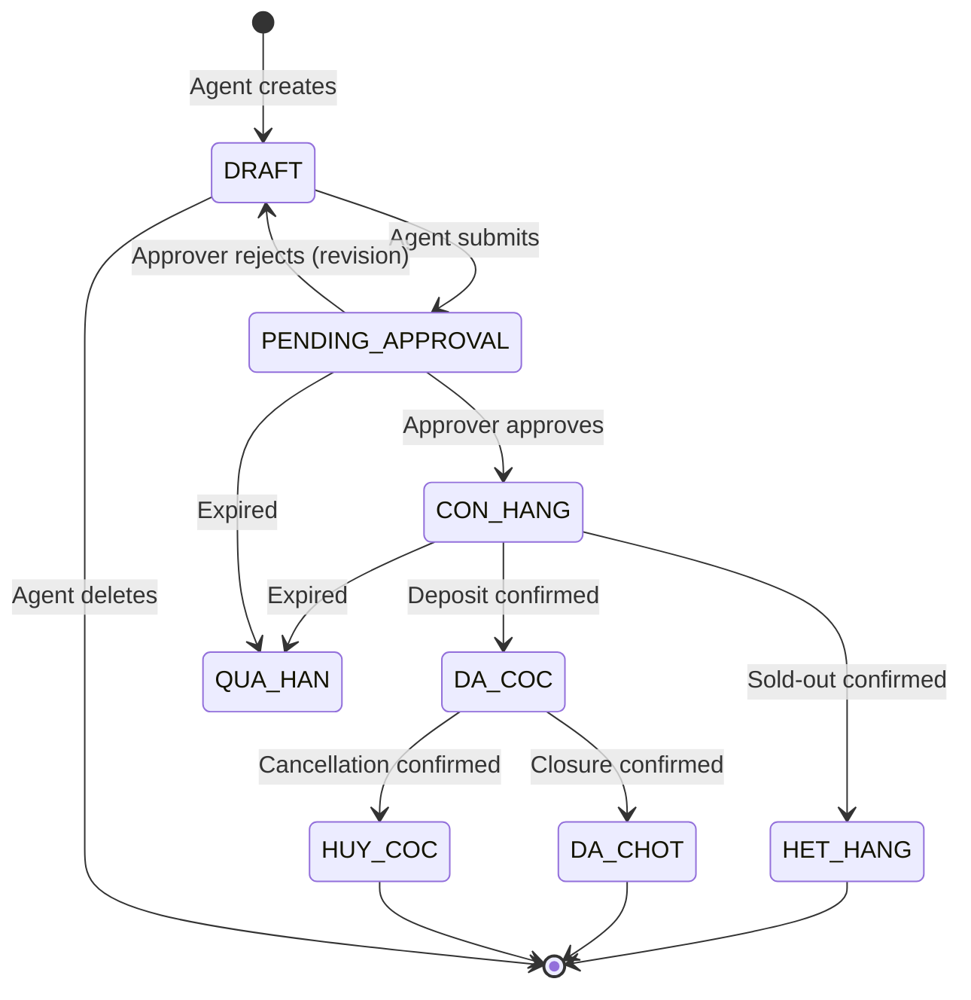
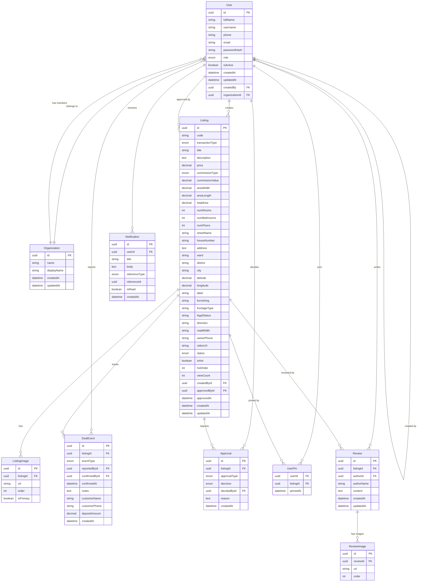
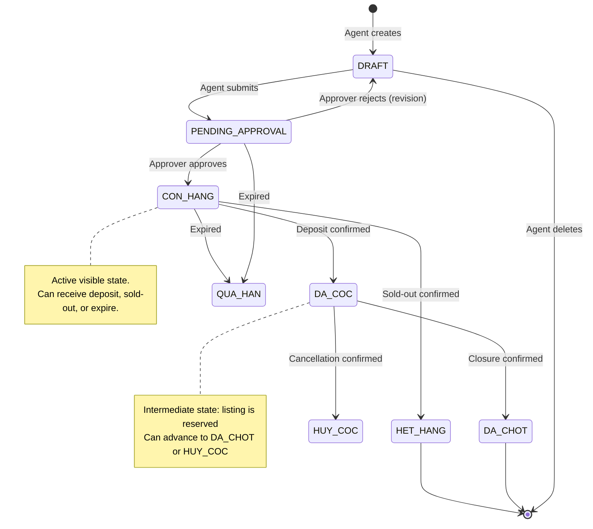

# Domain Model — Biglands

> **Version**: 1.1  
> **Source Documents**: business-spec.md, entities-erd.md, epics/, screens/, user-flows/  
> **Validation Status**: Cross-referenced against all source documents

---

## Table of Contents

1. [Entity: User](#1-entity-user)
2. [Entity: Listing](#2-entity-listing)
3. [Entity: ListingImage](#3-entity-listingimage)
4. [Entity: DealEvent](#4-entity-dealevent)
5. [Entity: Approval](#5-entity-approval)
6. [Entity: Notification](#6-entity-notification)
7. [Entity: UserPin](#7-entity-userpin)
8. [Entity: Review](#8-entity-review)
9. [Entity: ReviewImage](#9-entity-reviewimage)
10. [Entity: Organization](#10-entity-organization)
11. [Entity Relationship Diagram](#11-entity-relationship-diagram)
12. [Model Validation](#12-model-validation)
13. [Appendix: Status State Machine](#13-appendix-status-state-machine)
14. [Appendix: Event → Notification Mapping](#14-appendix-event--notification-mapping)

---

## Conventions Used

| Convention | Meaning |
|-----------|---------|
| `PK` | Primary Key |
| `FK` | Foreign Key |
| `Required` | Field must have a non-null value |
| `Auto` | Value is system-generated |
| `Enum` | Fixed set of allowed values |
| `?` | Optional field (may be null) |

---

## 1. Entity: User

### Purpose

Represents a registered platform user. All users are created by an Admin; self-registration is not supported. A user can act as an Agent, Approver, or Admin depending on their role assignment.

### Fields

| Field | Type | Required | Default | Description |
|-------|------|----------|---------|-------------|
| `id` | UUID | Yes (PK) | Auto | Unique identifier |
| `fullName` | String(255) | Yes | — | Display name |
| `username` | String(100) | Yes | — | Login username (unique) |
| `phone` | String(20) | No | — | Contact phone number |
| `email` | String(255) | No | — | Email address |
| `passwordHash` | String(255) | Yes | — | Bcrypt/Argon2 hashed password |
| `role` | Enum | Yes | AGENT | `AGENT` / `APPROVER` / `ADMIN` |
| `isActive` | Boolean | Yes | `true` | Whether account is active |
| `createdAt` | DateTime | Yes (Auto) | `now()` | Account creation timestamp |
| `updatedAt` | DateTime | Yes (Auto) | `now()` | Last update timestamp |
| `createdBy` | UUID (FK) | No | — | Admin who created this user (self-referencing FK → User.id) |
| `organizationId` | UUID (FK) | No | — | Organization this user belongs to (FK → Organization.id) |

### Relationships

| Relationship | Type | Target | Constraint |
|-------------|------|--------|-----------|
| Creates listings | 1:N | Listing | onDelete: RESTRICT (listings preserved on deactivation) |
| Reports deal events | 1:N | DealEvent | onDelete: RESTRICT |
| Performs approvals | 1:N | Approval | onDelete: RESTRICT |
| Receives notifications | 1:N | Notification | onDelete: CASCADE |
| Created by admin | N:1 | User | self-referencing; nullable for initial seed user |
| Belongs to organization | N:1 | Organization | onDelete: SET NULL |

### Constraints

| ID | Constraint | Source |
|----|-----------|--------|
| USR-C01 | `username` must be unique across all users | US-001-create-user |
| USR-C02 | `passwordHash` is required; minimum 8 characters if manually entered | SC-010 |
| USR-C03 | `role` must be one of `AGENT`, `APPROVER`, `ADMIN` | entities-erd |
| USR-C04 | At least one user with `role = ADMIN` and `isActive = true` must exist at all times | UM-002 |
| USR-C05 | `createdBy` must reference an existing user with `role = ADMIN` | user-management epic |

### Invariants

| ID | Invariant | Description |
|----|-----------|-------------|
| USR-I01 | Last admin protection | A user cannot deactivate themselves if they are the only active ADMIN (UM-001). A user's role cannot be changed away from ADMIN if they are the only ADMIN (UM-003). |
| USR-I02 | Deactivated login | A user with `isActive = false` must be rejected at login with "account deactivated" error (UM-004). |
| USR-I03 | Listing ownership on deactivation | Deactivated users' existing listings remain visible in the shared cart, but the user cannot create new listings or log in (UM-005). |
| USR-I04 | No self-deletion | User records are never hard-deleted; only soft-deactivated via `isActive` toggle. |
| USR-I05 | No self-registration | All users must be created by an existing ADMIN user (UM-006). |

### Lifecycle

```
[System Seed] → Admin creates user → User is ACTIVE
                                      ↓ (Admin deactivates)
                                   User is INACTIVE
                                      ↓ (Admin reactivates)
                                   User is ACTIVE

Role changes: AGENT ↔ APPROVER ↔ ADMIN (Admin assigns, at any time, subject to last-ADMIN invariant)
```

---

## 2. Entity: Listing

### Purpose

A property listing posted on the platform. Represents an entire CHDV building listed for transfer (SANG_NHUONG), rental (CHO_THUE), or sale (BAN). The listing progresses through a defined state machine from draft to terminal states.

### Fields

| Field | Type | Required | Default | Description |
|-------|------|----------|---------|-------------|
| `id` | UUID | Yes (PK) | Auto | Unique identifier |
| `code` | String(20) | Yes (Auto) | Auto | Product code: `YYMMDD` + random digits (e.g., `2505202605828`) |
| `transactionType` | Enum | Yes | BAN | `SANG_NHUONG` / `CHO_THUE` / `BAN` |
| `propertyType` | Enum | Yes | — | `NHA_PHO` / `CAN_HO` / `CHDV` / `DAT` / `BIET_THU` / `VAN_PHONG` / `MAT_BANG` / `KHO_XUONG` / `NHA_TRO` / `KHAC` |
| `title` | String(500) | No | — | Listing title (may contain property prefix: NNC, MT, HXH, CHDV) |
| `description` | Text | Yes | — | Detailed property description |
| `price` | Decimal(18,0) | Yes | — | Listing price in VND |
| `commissionType` | Enum | Yes | — | `PERCENTAGE` / `FLAT` |
| `commissionValue` | Decimal(18,0) | Yes | — | Percentage (e.g., 1.5) or fixed amount (VND) |
| `areaWidth` | Decimal(10,2) | Yes | — | Frontage width in meters |
| `areaLength` | Decimal(10,2) | Yes | — | Property length in meters |
| `totalArea` | Decimal(10,2) | Yes | — | Total floor area in m² (may be computed: width × length) |
| `numRooms` | Integer | Yes | 0 | Number of bedrooms |
| `numBathrooms` | Integer | Yes | 0 | Number of bathrooms/toilets |
| `numFloors` | Integer | Yes | 0 | Number of floors |
| `streetName` | String(255) | Yes | — | Street name |
| `houseNumber` | String(50) | Yes | — | House number |
| `address` | String(500) | Yes | — | Full address (composite: houseNumber + streetName + ward + district + city) |
| `ward` | String(100) | Yes | — | Ward (Phường) |
| `district` | String(100) | Yes | — | District (Quận) |
| `city` | String(100) | Yes | Hồ Chí Minh | City/Tỉnh |
| `latitude` | Decimal(10,8) | No | — | Geolocation latitude |
| `longitude` | Decimal(11,8) | No | — | Geolocation longitude |
| `label` | String(100) | No | — | Tag/label (e.g., "Thang máy", "Nhà mới", "Vị trí đẹp") |
| `furnishing` | String(500) | No | — | Furniture description (free text) |
| `frontageType` | String(100) | No | — | Mặt tiền / Hẻm (street front or alley type) |
| `legalStatus` | String(500) | No | — | Legal documentation status |
| `direction` | String(50) | No | — | House direction (hướng) — e.g., Đông, Tây, Nam, Bắc |
| `roadWidth` | String(50) | No | — | Alley/road width in meters |
| `ownerPhone` | String(20) | Yes | — | Property owner's phone number |
| `videoUrl` | String(500) | No | — | YouTube video link |
| `status` | Enum | Yes | DRAFT | `DRAFT` / `PENDING_APPROVAL` / `CON_HANG` / `DA_COC` / `HET_HANG` / `DA_CHOT` / `HUY_COC` / `QUA_HAN` / `TU_CHOI` |
| `isHot` | Boolean | No | `false` | Whether promoted to Hot by Admin |
| `hotOrder` | Integer | No | — | Display order in Hot section (null if not hot) |
| `viewCount` | Integer | No | 0 | Number of views |
| `createdById` | UUID (FK) | Yes | — | Agent who created listing |
| `approvedById` | UUID (FK) | No | — | Approver who approved listing |
| `approvedAt` | DateTime | No | — | Approval timestamp |
| `createdAt` | DateTime | Yes (Auto) | `now()` | Creation timestamp |
| `updatedAt` | DateTime | Yes (Auto) | `now()` | Last update timestamp |

> **Note on `isPinned`**: The ERD includes `isPinned` on Listing, but pinning is per-user (LV-003). This field has been removed from Listing and modelled as a separate join table `UserPin` (see §7). The `address` field is modelled as separate components to match the create form.

### Relationships

| Relationship | Type | Target | Constraint |
|-------------|------|--------|-----------|
| Created by user | N:1 | User | onDelete: RESTRICT |
| Approved by user | N:1 | User | onDelete: SET NULL |
| Has images | 1:N | ListingImage | onDelete: CASCADE |
| Tracks deal events | 1:N | DealEvent | onDelete: CASCADE |
| Requires approvals | 1:N | Approval | onDelete: CASCADE |
| Pinned by users | 1:N | UserPin | onDelete: CASCADE |

### Constraints

| ID | Constraint | Source |
|----|-----------|--------|
| LST-C01 | `code` must be unique and auto-generated in format YYMMDD + random digits | BR-012 |
| LST-C02 | `commissionType` and `commissionValue` are both required | BR-008, SC-004 |
| LST-C03 | At least one `ListingImage` must exist before `status` can transition from `DRAFT` to `PENDING_APPROVAL` | BR-007 |
| LST-C04 | Max 20 images per listing (enforced via ListingImage count) | BR-014 |
| LST-C05 | Max 1 YouTube video per listing | BR-014 |
| LST-C06 | Location cascade: `district` must be valid for `city`; `ward` must be valid for `district`. Validated via JSON-backed geography API (no DB dependency). | BR-013 |
| LST-C07 | `isHot` can only be set to `true` when `status = CON_HANG` | HP-002 |
| LST-C08 | `hotOrder` must be unique among hot listings; max 14 hot items | HP-004 |
| LST-C09 | `propertyType` is required and must be one of the PropertyType enum values | SC-004 |

### Invariants

| ID | Invariant | Description |
|----|-----------|-------------|
| LST-I01 | Status state machine | Status transitions must follow the defined state diagram. Invalid transitions must be rejected. |
| LST-I02 | One active deposit | A listing can have at most one deposit in `DA_COC` status at a time (BR-001). |
| LST-I03 | Visibility rules | Only `CON_HANG` and `DA_COC` listings are visible in the shared cart (LV-001, LV-002). |
| LST-I04 | Owner-only edit | Only `createdById` can edit the listing (BR-004). |
| LST-I05 | Re-approval trigger | Modifying `price`, `areaWidth`, `areaLength`, or `totalArea` on a `CON_HANG` listing sets `status = PENDING_APPROVAL` (ES-002). |
| LST-I06 | DRAFT deletion | Only `DRAFT` listings can be hard-deleted (ES-003). `CON_HANG` listings can be withdrawn to `DRAFT` (ES-004). |
| LST-I07 | Withdraw returns to DRAFT | Withdrawing a `CON_HANG` listing returns `status = DRAFT`. |
| LST-I08 | Listing counter | `BR-015`: The total count of `CON_HANG` listings across all transaction types is displayed globally. |

### Lifecycle



| From | To | Trigger | Requires |
|------|----|---------|----------|
| `DRAFT` | `PENDING_APPROVAL` | Agent submits | ≥1 image, all required fields |
| `DRAFT` | `DRAFT` (deleted) | Agent deletes | — |
| `PENDING_APPROVAL` | `CON_HANG` | Approver approves | — |
| `PENDING_APPROVAL` | `DRAFT` | Approver rejects | Rejection reason |
| `CON_HANG` | `DA_COC` | Deposit confirmed by approver | Prior DEPOSIT_REPORTED event |
| `CON_HANG` | `HET_HANG` | Sold-out confirmed | Prior SOLD_OUT_REPORTED event |
| `DA_COC` | `DA_CHOT` | Closure confirmed by approver | Prior CLOSURE_REPORTED event |
| `DA_COC` | `HUY_COC` | Cancellation confirmed by approver | Prior CANCELLATION_REPORTED event |
| `CON_HANG` | `QUA_HAN` | System expiration job | Configurable TTL |
| `PENDING_APPROVAL` | `QUA_HAN` | System expiration job | Configurable TTL |

---

## 3. Entity: ListingImage

### Purpose

Images associated with a listing. A listing must have at least one image to be submitted for approval, and can have up to 20 images total.

### Fields

| Field | Type | Required | Default | Description |
|-------|------|----------|---------|-------------|
| `id` | UUID | Yes (PK) | Auto | Unique identifier |
| `listingId` | UUID (FK) | Yes | — | Parent listing |
| `url` | String(1000) | Yes | — | Image URL |
| `order` | Integer | Yes | 0 | Display order (1-based) |
| `isPrimary` | Boolean | No | `false` | Whether this is the cover image |

### Relationships

| Relationship | Type | Target | Constraint |
|-------------|------|--------|-----------|
| Belongs to listing | N:1 | Listing | onDelete: CASCADE |

### Constraints

| ID | Constraint | Source |
|----|-----------|--------|
| IMG-C01 | Max 20 images per `listingId` | BR-014 |
| IMG-C02 | `order` must be unique per `listingId` | — |

### Invariants

| ID | Invariant | Description |
|----|-----------|-------------|
| IMG-I01 | At most one `isPrimary = true` per listing | — |
| IMG-I02 | `order` values should be sequential starting from 1 (not required, but recommended for display) | — |
| IMG-I03 | A listing must have at least one image before `status` can transition to `PENDING_APPROVAL` | BR-007 |

### Lifecycle

```
Created with listing → Displayed in gallery → (Agent edits: add/remove/reorder/change primary)
                                              ↓ (Listing deleted)
                                           Cascade deleted
```

---

## 4. Entity: DealEvent

### Purpose

Tracks the complete lifecycle events of a listing deal. Each event records who reported it and (if confirmed) who confirmed it. Events are immutable once created.

### Fields

| Field | Type | Required | Default | Description |
|-------|------|----------|---------|-------------|
| `id` | UUID | Yes (PK) | Auto | Unique identifier |
| `listingId` | UUID (FK) | Yes | — | Related listing |
| `eventType` | Enum | Yes | — | See event types below |
| `reportedById` | UUID (FK) | Yes | — | Agent who reported the event |
| `confirmedById` | UUID (FK) | No | — | Approver who confirmed the event |
| `confirmedAt` | DateTime | No | — | Confirmation timestamp |
| `notes` | Text | No | — | Additional notes or reason |
| `customerName` | String(255) | No* | — | Customer name (*required for deposit events) |
| `customerPhone` | String(20) | No | — | Customer phone |
| `depositAmount` | Decimal(18,0) | No* | — | Deposit amount in VND (*required for deposit events) |
| `createdAt` | DateTime | Yes (Auto) | `now()` | Event creation timestamp |

### Event Types

| Event | Meaning | Requires confirmation | Status on creation | Status after confirmation |
|-------|---------|---------------------|-------------------|--------------------------|
| `DEPOSIT_REPORTED` | Agent reports customer deposit | Yes | — (listing stays current status) | `DA_COC` |
| `DEPOSIT_CONFIRMED` | Approver confirms deposit | No | `DA_COC` | — |
| `CLOSURE_REPORTED` | Agent reports deal closure | Yes | — | — |
| `CLOSURE_CONFIRMED` | Approver confirms closure | No | `DA_CHOT` | — |
| `CANCELLATION_REPORTED` | Agent reports cancellation | Yes | — | — |
| `CANCELLATION_CONFIRMED` | Approver confirms cancellation | No | `HUY_COC` | — |
| `SOLD_OUT_REPORTED` | Agent reports sold-out | Yes | — | — |
| `SOLD_OUT_CONFIRMED` | Approver confirms sold-out | No | `HET_HANG` | — |

### Relationships

| Relationship | Type | Target | Constraint |
|-------------|------|--------|-----------|
| Belongs to listing | N:1 | Listing | onDelete: CASCADE |
| Reported by user | N:1 | User | onDelete: RESTRICT |
| Confirmed by user | N:1 | User | onDelete: SET NULL |

### Constraints

| ID | Constraint | Source |
|----|-----------|--------|
| DE-C01 | `customerName` and `depositAmount` required when `eventType` is `DEPOSIT_REPORTED` or `DEPOSIT_CONFIRMED` | DD-001 |
| DE-C02 | `customerName` must be ≥ 2 characters | US-001-report-deposit |
| DE-C03 | `depositAmount` must be > 0 | US-001-report-deposit |
| DE-C04 | `confirmedById` must reference a user with role `APPROVER` or `ADMIN` | BR-005 |
| DE-C05 | `confirmedById` must be set on `*_CONFIRMED` event types | — |
| DE-C06 | `notes` required for `CANCELLATION_REPORTED` | DD-005 |

### Invariants

| ID | Invariant | Description |
|----|-----------|-------------|
| DE-I01 | Event ordering | `DEPOSIT_REPORTED` → `DEPOSIT_CONFIRMED` must precede `CLOSURE_REPORTED` or `CANCELLATION_REPORTED`. `SOLD_OUT_REPORTED` does not require a deposit. |
| DE-I02 | No duplicate active deposit | A listing cannot have a `DEPOSIT_REPORTED` without a corresponding `DEPOSIT_CONFIRMED` or `CANCELLATION_CONFIRMED` when another active deposit exists (BR-001). |
| DE-I03 | Immutable events | Once created, DealEvent records must not be modified (append-only audit log). |
| DE-I04 | Status dependency | `DEPOSIT_REPORTED` only allowed when `Listing.status = CON_HANG`. `CLOSURE_REPORTED` and `CANCELLATION_REPORTED` only when `Listing.status = DA_COC`. `SOLD_OUT_REPORTED` only when `Listing.status = CON_HANG`. |

### Lifecycle

```
Agent action → *_REPORTED created (pending)
                         ↓
            Approver reviews in queue
                         ↓
              ┌──── APPROVED ────┐
              ↓                   ↓
        *_CONFIRMED         (Rejected — no CONFIRMED event,
        + status change       listing stays in current status)
```

---

## 5. Entity: Approval

### Purpose

Records every approval or rejection decision made by an approver/admin. Provides a complete audit trail of who decided what and why, attached to each listing.

### Fields

| Field | Type | Required | Default | Description |
|-------|------|----------|---------|-------------|
| `id` | UUID | Yes (PK) | Auto | Unique identifier |
| `listingId` | UUID (FK) | Yes | — | Related listing |
| `approvalType` | Enum | Yes | — | `LISTING_POST` / `DEPOSIT` / `CANCELLATION` / `CLOSURE` / `SOLD_OUT` |
| `decision` | Enum | Yes | — | `APPROVED` / `REJECTED` |
| `decidedById` | UUID (FK) | Yes | — | Approver who acted |
| `reason` | Text | No* | — | Reason (*required when `decision = REJECTED`) |
| `createdAt` | DateTime | Yes (Auto) | `now()` | Decision timestamp |

### Approval Types and Corresponding Queue Routes

| Approval Type | Queue Name | Route Pattern |
|--------------|-----------|---------------|
| `LISTING_POST` | Duyệt bài đăng | `/duyet/listing-post` |
| `DEPOSIT` | Duyệt báo cọc | `/duyet/deposit` |
| `CANCELLATION` | Duyệt huỷ cọc | `/duyet/cancellation` |
| `CLOSURE` | Duyệt chốt hàng | `/duyet/closure` |
| `SOLD_OUT` | Duyệt hết hàng | `/duyet/sold-out` |

Filtered by `transactionType` query parameter (`BAN`, `CHO_THUE`, `SANG_NHUONG`) on the queue page.

### Relationships

| Relationship | Type | Target | Constraint |
|-------------|------|--------|-----------|
| Belongs to listing | N:1 | Listing | onDelete: CASCADE |
| Decided by user | N:1 | User | onDelete: RESTRICT |

### Constraints

| ID | Constraint | Source |
|----|-----------|--------|
| APP-C01 | `decidedById` must reference a user with role `APPROVER` or `ADMIN` | BR-005 |
| APP-C02 | `reason` is required when `decision = REJECTED` | AP-002, US-002-reject-listing-post |
| APP-C03 | At creation time, `Listing.status` must match the expected status for the `approvalType` (see AR-01) | AP-001 |

### Status Mapping for Approval Types

| Approval Type | Required Listing Status on Decision |
|--------------|-----------------------------------|
| `LISTING_POST` | `PENDING_APPROVAL` |
| `DEPOSIT` | `CON_HANG` (a `DEPOSIT_REPORTED` DealEvent exists) |
| `CLOSURE` | `DA_COC` (a `DEPOSIT_CONFIRMED` DealEvent exists) |
| `CANCELLATION` | `DA_COC` (a `DEPOSIT_CONFIRMED` DealEvent exists) |
| `SOLD_OUT` | `CON_HANG` (a `SOLD_OUT_REPORTED` DealEvent exists) |

### Resulting Status Changes

| Decision | Approval Type | New Listing Status |
|----------|--------------|-------------------|
| APPROVED | `LISTING_POST` | `CON_HANG` |
| REJECTED | `LISTING_POST` | `DRAFT` |
| APPROVED | `DEPOSIT` | `DA_COC` |
| REJECTED | `DEPOSIT` | `CON_HANG` |
| APPROVED | `CLOSURE` | `DA_CHOT` |
| REJECTED | `CLOSURE` | `DA_COC` |
| APPROVED | `CANCELLATION` | `CON_HANG` (relisted) |
| REJECTED | `CANCELLATION` | `DA_COC` |
| APPROVED | `SOLD_OUT` | `HET_HANG` |
| REJECTED | `SOLD_OUT` | `CON_HANG` |

### Invariants

| ID | Invariant | Description |
|----|-----------|-------------|
| APP-I01 | Append-only | Approval records are immutable once created. |
| APP-I02 | Concurrent guard | Only the first approval decision for a given (listing, approvalType) takes effect. Subsequent attempts must fail with "Already processed" (US-001-approve-listing-post). |
| APP-I03 | Bulk-approve scope | Bulk approval is supported for `LISTING_POST` only; all other types require individual decisions. |

### Lifecycle

```
Created when approver clicks Approve or Reject → Immutable record
                                                   ↓
                                     Used for audit trail + notification trigger
```

---

## 6. Entity: Notification

### Purpose

System notification for users, created automatically when key events occur. Notifications are role-scoped: agents see only notifications relevant to their listings; admins see all system-wide notifications.

### Fields

| Field | Type | Required | Default | Description |
|-------|------|----------|---------|-------------|
| `id` | UUID | Yes (PK) | Auto | Unique identifier |
| `userId` | UUID (FK) | Yes | — | Recipient user |
| `title` | String(500) | Yes | — | Notification title |
| `body` | Text | Yes | — | Notification content |
| `referenceType` | Enum | No | — | `LISTING` / `APPROVAL` / `DEAL_EVENT` |
| `referenceId` | UUID | No | — | Related entity ID (polymorphic FK) |
| `isRead` | Boolean | Yes | `false` | Whether user has read it |
| `eventType` | String(100) | No | — | Structured event type (e.g., `listing_submitted`, `deposit_confirmed`) |
| `actorName` | String(255) | No | — | Display name of the user who triggered the event |
| `transactionType` | String(50) | No | — | Transaction type context (`BAN`, `CHO_THUE`, `SANG_NHUONG`) |
| `createdAt` | DateTime | Yes (Auto) | `now()` | Creation timestamp |

> **Note**: `eventType`, `actorName`, and `transactionType` are nullable for backward compatibility. New notifications always include these fields.

### Relationships

| Relationship | Type | Target | Constraint |
|-------------|------|--------|-----------|
| Belongs to user | N:1 | User | onDelete: CASCADE |

### Constraints

| ID | Constraint | Source |
|----|-----------|--------|
| NTF-C01 | `referenceType` + `referenceId` must be both null or both non-null (polymorphic reference) | — |
| NTF-C02 | `isRead` defaults to `false` | US-002-mark-read |

### Invariants

| ID | Invariant | Description |
|----|-----------|-------------|
| NTF-I01 | Role-scoped retrieval | Agents only see notifications for listings they created or events they reported. Admins see all notifications (BR-010). Approvers see notifications for transaction types/queues they oversee (AR-07 — ambiguous, needs resolution). |
| NTF-I02 | Display order | Notifications are displayed in reverse-chronological order (newest first) (UI-006). |
| NTF-I03 | Relative timestamps | Display uses Vietnamese relative time: "vài giây trước", "N giờ trước", "N ngày trước" (UI-006). |
| NTF-I04 | Click navigation | Clicking a notification navigates to the related listing at `/tin/:id` using `referenceId`. |
| NTF-I05 | Unread badge | The notification bell displays a count of notifications where `isRead = false`. |
| NTF-I06 | Mark as read | Reading a notification sets `isRead = true` and decrements the badge. "Mark All as Read" bulk-sets `isRead = true` for all notifications belonging to the current user. |

### Lifecycle

```
System event triggers → Notification created (isRead = false)
                                              ↓
                              User views notification list
                                              ↓
                              User clicks → isRead = true
                                     or
                              "Mark All as Read" → isRead = true (batch)
```

### Notification Event Triggers

| Trigger Event | Recipient(s) | Title Pattern |
|--------------|-------------|---------------|
| Listing approved (`LISTING_POST` → APPROVED) | Listing creator (Agent) | `[Transaction type] [User] [đã duyệt] [Product code]` |
| Listing rejected (`LISTING_POST` → REJECTED) | Listing creator (Agent) | `[Transaction type] [User] [từ chối] [Product code]: [reason]` |
| Deposit reported (`DEPOSIT_REPORTED`) | Approvers | `[Transaction type] [User] [báo cọc] [Product code]` |
| Deposit confirmed (`DEPOSIT_CONFIRMED`) | Reporting agent | `[Transaction type] [User] [đã chốt cọc] thành công [Product code]` |
| Closure reported (`CLOSURE_REPORTED`) | Approvers | `[Transaction type] [User] [báo chốt hàng] [Product code]` |
| Closure confirmed (`CLOSURE_CONFIRMED`) | Reporting agent | `[Transaction type] [User] [đã chốt hàng] thành công [Product code]` |
| Cancellation reported (`CANCELLATION_REPORTED`) | Approvers | `[Transaction type] [User] [báo huỷ cọc] [Product code]` |
| Cancellation confirmed (`CANCELLATION_CONFIRMED`) | Reporting agent | `[Transaction type] [User] [đã huỷ cọc] [Product code]` |
| Sold-out reported (`SOLD_OUT_REPORTED`) | Approvers | `[Transaction type] [User] [báo hết hàng] [Product code]` |
| Sold-out confirmed (`SOLD_OUT_CONFIRMED`) | Reporting agent | `[Transaction type] [User] [đã hết] [Product code]` |
| Listing expired (`QUA_HAN`) | Listing creator | `[Transaction type] [Product code] [đã quá hạn]` |

---

## 7. Entity: UserPin

### Purpose

Many-to-many relationship between User and Listing representing per-user bookmarks. Replaces the `Listing.isPinned` boolean (which incorrectly models pinning as a global state instead of per-user).

**Rationale**: LV-003 states "Pinning is a per-user preference, not a global state." The ERD's `Listing.isPinned` boolean cannot represent per-user data without a join table.

### Fields

| Field | Type | Required | Default | Description |
|-------|------|----------|---------|-------------|
| `userId` | UUID (FK) | Yes (PK) | — | User who pinned |
| `listingId` | UUID (FK) | Yes (PK) | — | Listing that was pinned |
| `pinnedAt` | DateTime | Yes (Auto) | `now()` | When the pin was created |

### Relationships

| Relationship | Type | Target | Constraint |
|-------------|------|--------|-----------|
| Belongs to user | N:1 | User | onDelete: CASCADE |
| Belongs to listing | N:1 | Listing | onDelete: CASCADE |

### Constraints

| ID | Constraint |
|----|-----------|
| PIN-C01 | Composite primary key (`userId`, `listingId`) prevents duplicate pins |

### Invariants

| ID | Invariant | Description |
|----|-----------|-------------|
| PIN-I01 | Toggle-based | Pin and unpin are idempotent toggle operations. Pinning an already-pinned listing is a no-op; unpinning an unpinned listing is a no-op. |

---

## 8. Entity: Review

### Purpose

User reviews on listings. Authenticated users can submit text reviews about a property. Reviews are auto-published (no pre-moderation) and limited to one review per user per listing.

### Fields

| Field | Type | Required | Default | Description |
|-------|------|----------|---------|-------------|
| `id` | UUID | Yes (PK) | Auto | Unique identifier |
| `listingId` | UUID (FK) | Yes | — | Reviewed listing |
| `authorId` | UUID (FK) | Yes | — | User who wrote the review |
| `authorName` | String(255) | Yes | — | Display name of the author (denormalized) |
| `content` | Text | Yes | — | Review text (1–2000 characters) |
| `createdAt` | DateTime | Yes (Auto) | `now()` | Submission timestamp |
| `updatedAt` | DateTime | Yes (Auto) | `now()` | Last update timestamp |

### Relationships

| Relationship | Type | Target | Constraint |
|-------------|------|--------|-----------|
| Belongs to listing | N:1 | Listing | onDelete: CASCADE |
| Written by user | N:1 | User | onDelete: RESTRICT |
| Has images | 1:N | ReviewImage | onDelete: CASCADE |

### Constraints

| ID | Constraint | Source |
|----|-----------|--------|
| REV-C01 | At most one review per `(authorId, listingId)` pair (unique constraint) | BR-016 |
| REV-C02 | `content` must be non-empty (1–2000 characters) | SC-003 |
| REV-C03 | Max 10 images per review | SC-003 |

### Invariants

| ID | Invariant | Description |
|----|-----------|-------------|
| REV-I01 | Auto-published | Reviews are visible immediately; no approval queue. |
| REV-I02 | No rating system | Reviews are text-only; numerical ratings are not used. |
| REV-I03 | Author-only delete | Only the review author or an Admin can delete a review. |
| REV-I04 | Image belongs to same listing | A review image's parent review must have `listingId` matching the listing context. |

### Lifecycle

```
User writes review → Auto-published (visible immediately)
                      ↓
           Author/Admin deletes → Removed permanently (no soft-delete)
```

### Authorship Rules

- Any authenticated user with role AGENT, APPROVER, or ADMIN can write a review on any listing.
- The same user cannot write a second review for the same listing (409 Conflict on duplicate).
- The author's display name is denormalized into `authorName` to preserve it if the user changes their name.

---

## 9. Entity: ReviewImage

### Purpose

Images attached to a review. Follows the same storage pattern as ListingImage but without a primary image concept.

### Fields

| Field | Type | Required | Default | Description |
|-------|------|----------|---------|-------------|
| `id` | UUID | Yes (PK) | Auto | Unique identifier |
| `reviewId` | UUID (FK) | Yes | — | Parent review |
| `url` | String(1000) | Yes | — | Image URL |
| `order` | Integer | Yes | 0 | Display order (1-based) |

### Relationships

| Relationship | Type | Target | Constraint |
|-------------|------|--------|-----------|
| Belongs to review | N:1 | Review | onDelete: CASCADE |

### Constraints

| ID | Constraint | Source |
|----|-----------|--------|
| RIMG-C01 | Max 10 images per `reviewId` | SC-003 |
| RIMG-C02 | `order` must be unique per `reviewId` | — |

### Lifecycle

```
Uploaded with review → Displayed in review gallery → Cascade deleted when review is deleted
```

---

## 10. Entity: Organization

### Purpose

Represents a team or real estate agency within the platform. Users are optionally assigned to an organization, which determines the display name shown in role columns and user lists.

### Fields

| Field | Type | Required | Default | Description |
|-------|------|----------|---------|-------------|
| `id` | UUID | Yes (PK) | Auto | Unique identifier |
| `name` | String(100) | Yes | — | Unique organization slug/identifier (e.g., `mq-land`) |
| `displayName` | String(255) | Yes | — | Human-readable display name (e.g., "MQ Land") |
| `createdAt` | DateTime | Yes (Auto) | `now()` | Creation timestamp |
| `updatedAt` | DateTime | Yes (Auto) | `now()` | Last update timestamp |

### Relationships

| Relationship | Type | Target | Constraint |
|-------------|------|--------|-----------|
| Has users | 1:N | User | onDelete: SET NULL |

### Constraints

| ID | Constraint | Source |
|----|-----------|--------|
| ORG-C01 | `name` must be unique across all organizations | — |
| ORG-C02 | `name` cannot be changed after creation (immutable identifier) | — |

### Invariants

| ID | Invariant | Description |
|----|-----------|-------------|
| ORG-I01 | Admin-only write | Only users with role ADMIN can create, update, or delete organizations. All authenticated users can read. |
| ORG-I02 | No delete with members | An organization cannot be deleted if it has active users assigned. |

### Lifecycle

```
Admin creates organization → Available for user assignment
                              ↓
          Admin updates display name → Updated in user list display
                              ↓
          Admin deletes (if no members) → Removed; users' organizationId set to null
```

---

## 11. Entity Relationship Diagram



---

## 12. Model Validation

### 10.1 Deviations from Original ERD

The following intentional deviations have been made from the original `entities-erd.md` based on cross-referencing with business-spec.md, screen specs, and user flows:

| ID | Original ERD | Updated Model | Rationale |
|----|-------------|---------------|-----------|
| D-01 | `Listing.isPinned` (boolean) | Removed; replaced by `UserPin` join table | Pinning is per-user (LV-003); a boolean on Listing incorrectly models this as global state |
| D-02 | `Listing.address` (single string) | Split into `streetName`, `houseNumber`, `address` (composite) | Create form (SC-004) requires separate street and house number fields |
| D-03 | `Listing.commissionType`, `commissionValue` (optional) | Changed to **required** | BR-008 and SC-004 form mandate commission for all transaction types (see C-07) |
| D-04 | No `Listing.ownerPhone` | Added `ownerPhone` (required) | Present in create form (SC-004) and product detail (SC-003) |
| D-05 | No `Listing.videoUrl` | Added `videoUrl` (optional) | Present in create form (SC-004) with YouTube link support |
| D-06 | No `Listing.hotOrder` | Added `hotOrder` (optional) | Hot products require ordering (HP-003); `isHot` alone is insufficient |
| D-07 | `Notification.referenceType` with 3 values | Extended to support: `LISTING`, `APPROVAL`, `DEAL_EVENT` | Aligned with notification event triggers in user-flows |
| D-08 | `Notification` had only opaque `title`/`body` | Added `eventType`, `actorName`, `transactionType` structured fields | Screen SC-007 shows structured notification format; enables client-side grouping without text parsing |
| D-09 | `Listing.pricePerM2` not in model | Computed in mapper as `price / totalArea` (not stored in DB) | Screen SC-002/SC-003 display price/m²; computed avoids data redundancy |
| D-10 | `ListingResponse.creator` not in model | Embedded `CreatorInfo { id, fullName, phone }` via `selectinload` | Screen SC-002/SC-003 show agent name+phone on every listing card; avoids N+1 queries |
| D-11 | `Tranaction type lock` not defined | Editing `transaction_type` blocked when `listing.status == DA_COC` | Prevents changing tx type on an already-deposited listing (AR-04) |

### 12.2 Remaining Model Gaps

| ID | Gap | Impact | Source | Status |
|----|-----|--------|--------|--------|
| G-01 | No `Review` entity | UI exists (SC-003) but no domain definition | MR-01 | **Resolved** — implemented as text-only reviews, auto-published, max 1 per user per listing (v1.1) |
| G-02 | Notification preferences undefined | Story exists (US-003) but epic declares out of scope; may require a new entity | C-04 | Open |
| G-03 | Organization/Team concept absent | Role column in user list (SC-009) shows org names ("MQ Land", "ID Land") not enum values | AR-13 | **Resolved** — Organization entity implemented (v1.1) |
| G-04 | `QUA_HAN` expiration mechanism undefined | State machine includes expired state but no trigger mechanism defined | MR-03 | Open |
| G-05 | Review image storage undefined | Max 10 images per review but no entity or storage pattern | MR-01 | **Resolved** — ReviewImage entity mirrors ListingImage pattern (v1.1) |
| G-06 | `ReviewImage` entity needed if reviews allow images | Would mirror `ListingImage` pattern | MR-01 | **Resolved** — implemented (v1.1) |

### 12.3 Contradictions Impacting the Model

These unresolved contradictions from business-spec.md affect the domain model and must be resolved before implementation:

| ID | Issue | Entities Affected | Resolution Needed |
|----|-------|------------------|-------------------|
| C-01 | Commission required for all vs only SANG_NHUONG/BAN | Listing | Confirm commission requirement for CHO_THUE |
| C-02 | Deposit report changes status immediately vs pending | Listing, DealEvent | Define intermediate deposit-pending status |
| C-03 | Deal actions by any agent vs only listing owner | Listing (permissions) | Resolved: any agent on any listing (BR-004) |
| C-09 | Immediate DA_COC vs intermediate pending | Listing (status enum) | Possibly add `DA_COC_PENDING` status |
| C-11 | Can Admin create listings? | Listing, User | Confirm all roles can create; Admin auto-approval |

---

## 13. Appendix: Status State Machine



### Status Transition Table

| Current Status | Allowed Next Status | Trigger | Actor |
|---------------|-------------------|---------|-------|
| `DRAFT` | `PENDING_APPROVAL` | Submit for approval | Agent |
| `DRAFT` | `[DELETED]` | Delete listing | Agent (owner) |
| `PENDING_APPROVAL` | `CON_HANG` | Approve | Approver/Admin |
| `PENDING_APPROVAL` | `DRAFT` | Reject | Approver/Admin |
| `PENDING_APPROVAL` | `QUA_HAN` | Expired | System |
| `CON_HANG` | `DA_COC` | Deposit confirmed | Approver/Admin |
| `CON_HANG` | `HET_HANG` | Sold-out confirmed | Approver/Admin |
| `CON_HANG` | `DRAFT` | Withdraw | Agent (owner) |
| `CON_HANG` | `QUA_HAN` | Expired | System |
| `DA_COC` | `DA_CHOT` | Closure confirmed | Approver/Admin |
| `DA_COC` | `HUY_COC` | Cancellation confirmed | Approver/Admin |
| `DA_COC` | — | No other transitions allowed | — |
| `HET_HANG` | — | Terminal state | — |
| `DA_CHOT` | — | Terminal state | — |
| `HUY_COC` | — | Terminal state | — |
| `QUA_HAN` | — | Terminal state | — |

---

## 14. Appendix: Event → Notification Mapping

| Trigger Event | DealEvent Created | Approval Created | Notification Sent To |
|--------------|------------------|-----------------|---------------------|
| Agent submits listing | — | — | Approvers (pending approval) |
| Approver approves listing | — | `LISTING_POST` / `APPROVED` | Listing creator (Agent) |
| Approver rejects listing | — | `LISTING_POST` / `REJECTED` | Listing creator (Agent) + reason |
| Agent reports deposit | `DEPOSIT_REPORTED` | — | Approvers |
| Approver confirms deposit | `DEPOSIT_CONFIRMED` | `DEPOSIT` / `APPROVED` | Reporting agent |
| Approver rejects deposit | — | `DEPOSIT` / `REJECTED` | Reporting agent |
| Agent reports closure | `CLOSURE_REPORTED` | — | Approvers |
| Approver confirms closure | `CLOSURE_CONFIRMED` | `CLOSURE` / `APPROVED` | Reporting agent |
| Approver rejects closure | — | `CLOSURE` / `REJECTED` | Reporting agent |
| Agent reports cancellation | `CANCELLATION_REPORTED` | — | Approvers |
| Approver confirms cancellation | `CANCELLATION_CONFIRMED` | `CANCELLATION` / `APPROVED` | Reporting agent |
| Approver rejects cancellation | — | `CANCELLATION` / `REJECTED` | Reporting agent |
| Agent reports sold-out | `SOLD_OUT_REPORTED` | — | Approvers |
| Approver confirms sold-out | `SOLD_OUT_CONFIRMED` | `SOLD_OUT` / `APPROVED` | Reporting agent |
| Approver rejects sold-out | — | `SOLD_OUT` / `REJECTED` | Reporting agent |
| Listing expired | — | — | Listing creator |

---

*End of Domain Model — Biglands v1.1*
