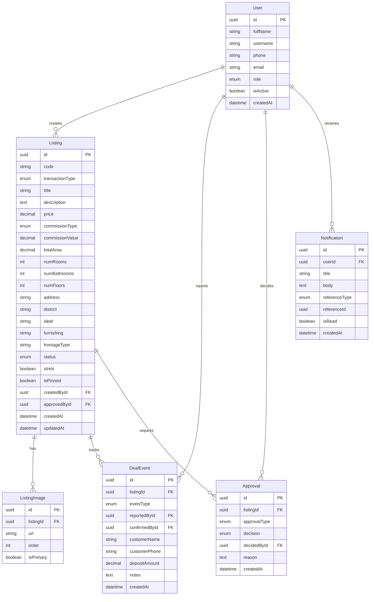
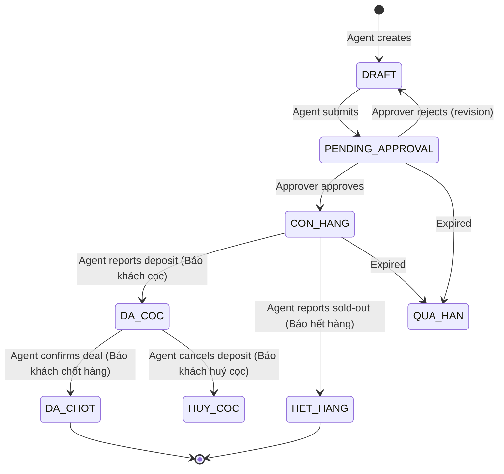

# Domain Entities

## Entity: User

Registered platform user (agent, approver, admin).

| Field | Type | Required | Description |
|-------|------|----------|-------------|
| id | UUID | Yes | Unique identifier |
| fullName | String | Yes | Display name |
| username | String | Yes | Login username |
| phone | String | No | Phone number (contact) |
| email | String | No | Email address |
| passwordHash | String | Yes | Hashed password |
| role | Enum | Yes | AGENT \| APPROVER \| ADMIN |
| isActive | Boolean | Yes | Whether account is active |
| createdAt | DateTime | Yes | Account creation timestamp |
| updatedAt | DateTime | Yes | Last update timestamp |
| createdBy | UUID | No | Admin who created this user |

Relationships:
- User creates Listings (1:N)
- User creates DealEvents (1:N)
- User performs Approvals (1:N)
- User receives Notifications (1:N)

## Entity: Listing

A property listing posted on the platform.

| Field | Type | Required | Description |
|-------|------|----------|-------------|
| id | UUID | Yes | Unique identifier |
| code | String | Yes | Auto-generated product code (format: YYMMDD + random digits) |
| transactionType | Enum | Yes | SANG_NHUONG \| CHO_THUE \| BAN |
| title | String | Yes | Listing title |
| description | Text | No | Detailed description |
| price | Decimal | Yes | Listing price in VND |
| commissionType | Enum | No | PERCENTAGE \| FLAT |
| commissionValue | Decimal | No | Commission amount or percentage |
| areaWidth | Decimal | No | Frontage width (m) |
| areaLength | Decimal | No | Property length (m) |
| totalArea | Decimal | Yes | Total floor area (m²) |
| numRooms | Integer | No | Number of bedrooms |
| numBathrooms | Integer | No | Number of bathrooms |
| numFloors | Integer | No | Number of floors |
| address | String | Yes | Full address |
| ward | String | Yes | Ward (Phường) |
| district | String | Yes | District (Quận) |
| city | String | Yes | City (default: Hồ Chí Minh) |
| latitude | Decimal | No | Geolocation latitude |
| longitude | Decimal | No | Geolocation longitude |
| label | String | No | Tag/label (e.g., "Thang máy", "Nhà mới", "Vị trí đẹp") |
| furnishing | String | No | Furniture description (free text) |
| frontageType | String | No | Mặt tiền/Hẻm (street front or alley type) |
| legalStatus | String | No | Legal documentation status |
| direction | String | No | House direction (hướng) |
| roadWidth | String | No | Alley/road width |
| status | Enum | Yes | DRAFT \| PENDING_APPROVAL \| CON_HANG \| DA_COC \| HET_HANG \| DA_CHOT \| HUY_COC \| QUA_HAN \| TU_CHOI |
| isHot | Boolean | No | Whether promoted to hot |
| isPinned | Boolean | No | Whether pinned by current user |
| viewCount | Integer | No | Number of views |
| createdById | UUID | Yes | Agent who created listing |
| approvedById | UUID | No | Approver who approved listing |
| approvedAt | DateTime | No | Approval timestamp |
| createdAt | DateTime | Yes | Creation timestamp |
| updatedAt | DateTime | Yes | Last update timestamp |

Relationships:
- Listing belongs to User (creator) (N:1)
- Listing has ListingImages (1:N)
- Listing has DealEvents (1:N)
- Listing has Approvals (1:N)

## Entity: ListingImage

Images associated with a listing.

| Field | Type | Required | Description |
|-------|------|----------|-------------|
| id | UUID | Yes | Unique identifier |
| listingId | UUID | Yes | Parent listing |
| url | String | Yes | Image URL |
| order | Integer | Yes | Display order |
| isPrimary | Boolean | No | Whether this is the cover image |

Relationships:
- ListingImage belongs to Listing (N:1)

## Entity: DealEvent

Tracks the lifecycle events of a listing deal.

| Field | Type | Required | Description |
|-------|------|----------|-------------|
| id | UUID | Yes | Unique identifier |
| listingId | UUID | Yes | Related listing |
| eventType | Enum | Yes | DEPOSIT_REPORTED \| DEPOSIT_CONFIRMED \| CLOSURE_REPORTED \| CLOSURE_CONFIRMED \| CANCELLATION_REPORTED \| CANCELLATION_CONFIRMED \| SOLD_OUT_REPORTED \| SOLD_OUT_CONFIRMED |
| reportedById | UUID | Yes | Agent who reported the event |
| confirmedById | UUID | No | Approver who confirmed the event |
| confirmedAt | DateTime | No | Confirmation timestamp |
| notes | Text | No | Additional notes |
| customerName | String | No | Customer name (for deposits) |
| customerPhone | String | No | Customer phone (for deposits) |
| depositAmount | Decimal | No | Deposit amount in VND |
| createdAt | DateTime | Yes | Event creation timestamp |

Relationships:
- DealEvent belongs to Listing (N:1)
- DealEvent reported by User (N:1)
- DealEvent confirmed by User (N:1)

## Entity: Approval

Records of approval/rejection actions.

| Field | Type | Required | Description |
|-------|------|----------|-------------|
| id | UUID | Yes | Unique identifier |
| listingId | UUID | Yes | Related listing |
| approvalType | Enum | Yes | LISTING_POST \| DEPOSIT \| CANCELLATION \| CLOSURE \| SOLD_OUT |
| decision | Enum | Yes | APPROVED \| REJECTED |
| decidedById | UUID | Yes | Approver who acted |
| reason | Text | No | Rejection reason |
| createdAt | DateTime | Yes | Decision timestamp |

Relationships:
- Approval belongs to Listing (N:1)
- Approval decided by User (N:1)

## Entity: Notification

System notification for users.

| Field | Type | Required | Description |
|-------|------|----------|-------------|
| id | UUID | Yes | Unique identifier |
| userId | UUID | Yes | Recipient user |
| title | String | Yes | Notification title |
| body | Text | Yes | Notification content |
| referenceType | Enum | No | LISTING \| APPROVAL \| DEAL_EVENT |
| referenceId | UUID | No | Related entity ID |
| isRead | Boolean | Yes | Whether user has read it |
| createdAt | DateTime | Yes | Creation timestamp |

Relationships:
- Notification belongs to User (N:1)

---

## ERD

---

## State Machine: Listing Status

> Actual UI status labels: "Còn hàng" (CON_HANG), "Hết hàng" (HET_HANG)

---

## Cross-Entity Business Rules

- BR-001 A listing can only have one active deposit at a time.
- BR-002 Cancellation can only be reported after a deposit has been reported.
- BR-003 Closure can only be reported after a deposit has been reported.
- BR-004 Any agent can report deposit, closure, cancellation, or sold-out on any listing (not just their own). Only the listing owner can edit listing info.
- BR-005 Only an APPROVER or ADMIN can confirm approval/rejection decisions.
- BR-006 A rejected listing returns to DRAFT status for revision.
- BR-007 A listing must have at least one image before submission.
- BR-008 Commission must be specified for all transaction types (SANG_NHUONG, CHO_THUE, BAN).
- BR-009 Hot products are visible on the homepage with a HOT badge.
- BR-010 Users can see notifications scoped to their role: agents see only relevant notifications, admins see all system-wide notifications.
- BR-011 Commission can be either a percentage (%) or fixed amount (VNĐ).
- BR-012 Product code is auto-generated in format YYMMDD + random digits (e.g., 2505202605828).
- BR-013 Location uses a 3-level cascade: City → District → Ward (Ward disabled until District selected).
- BR-014 A listing can have up to 20 images and 1 YouTube video.
- BR-015 The global listing counter shows the total count of active listings across all transaction types.
