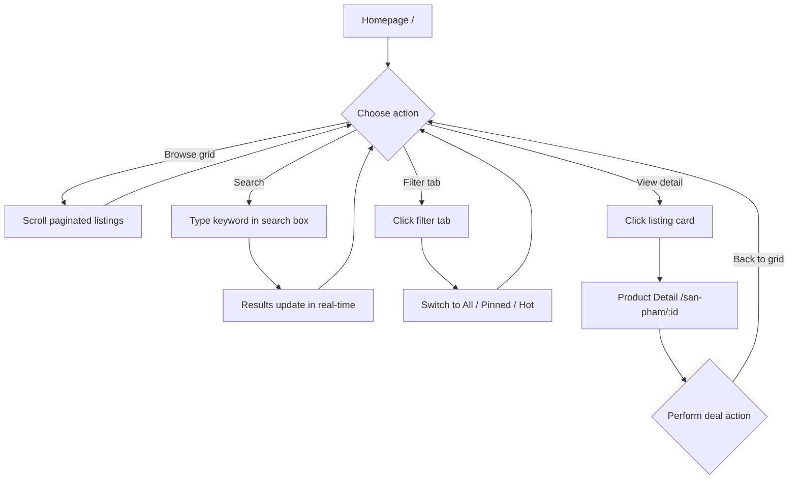

# Browse & Discover

## Goal

Agent browses available listings, filters by type, searches, pins favorites, and navigates to product detail.

## Trigger

User logs in and lands on homepage.

## Preconditions

- User is authenticated

## Main Flow

## Alternative Flows

- **Empty results**: Show empty state message with search term
- **No listings**: Show empty state
- **Pin**: User can pin listings for quick access via "Đã ghim" filter

## Screen References

- SC-002 Shared Cart Home
- SC-003 Product Detail

## Story References

- Shared Cart Browsing US-001 (browse), US-002 (search), US-003 (filter), US-004 (view detail), US-005 (pin)
