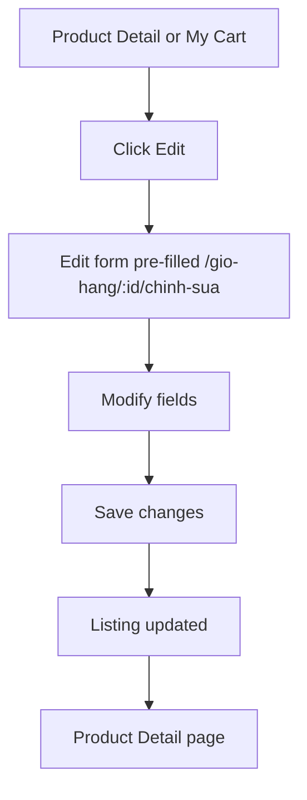

# Edit Listing

## Goal

Agent modifies an existing listing's attributes.

## Trigger

Agent clicks "Edit" on their own listing (from My Cart or Product Detail).

## Preconditions

- User is logged in as the listing owner
- Listing exists and is editable (status-dependent)

## Main Flow

## Alternative Flows

- **Listing already approved**: Editing may require re-submission for approval
- **Draft listing**: Save without re-submission
- **Validation failure**: Show inline errors, stay on form

## Screen References

- SC-005 Edit Listing
- SC-003 Product Detail
- SC-006 My Cart

## Story References

- Listing Management US-002 (edit listing)
