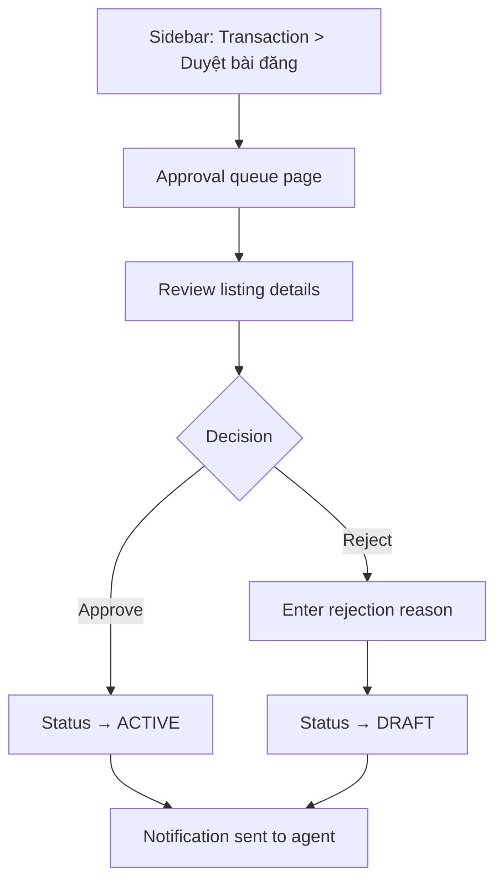

# Approve Listing Post

## Goal

Approver reviews and approves or rejects a newly submitted listing.

## Trigger

Approver navigates to the post-approval queue for a transaction type.

## Preconditions

- User is logged in as Approver or Admin
- At least one listing is in PENDING_APPROVAL status

## Main Flow

## Alternative Flows

- **Bulk approve**: Select multiple items and approve at once
- **View listing**: Click to open product detail in new tab

## Screen References

- SC-008 Approval Queue

## Story References

- Approval Workflow US-001 (approve), US-002 (reject), US-003 (bulk approve)
