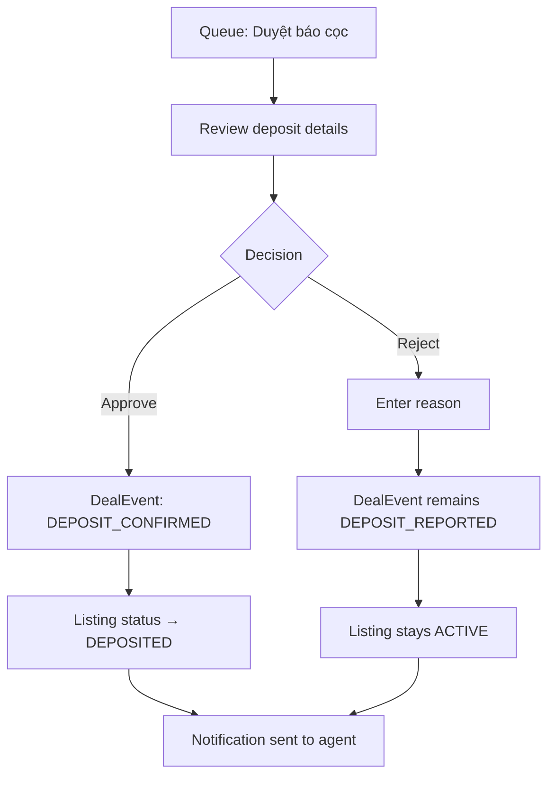

# Deposit Approval Pipeline

## Goal

Approver confirms or rejects a deposit reported by an agent.

## Trigger

Approver navigates to deposit approval queue (e.g., `/admin/ban/duyet-bao-coc`).

## Preconditions

- User is logged in as Approver or Admin
- A deposit has been reported (DEPOSIT_REPORTED event exists)

## Main Flow

## Alternative Flows

- **Reject**: Listing returns to ACTIVE; agent can report deposit again

## Screen References

- SC-008 Approval Queue

## Story References

- Deposit/Deal Lifecycle US-002 (approve deposit), US-005 (approve cancellation)
