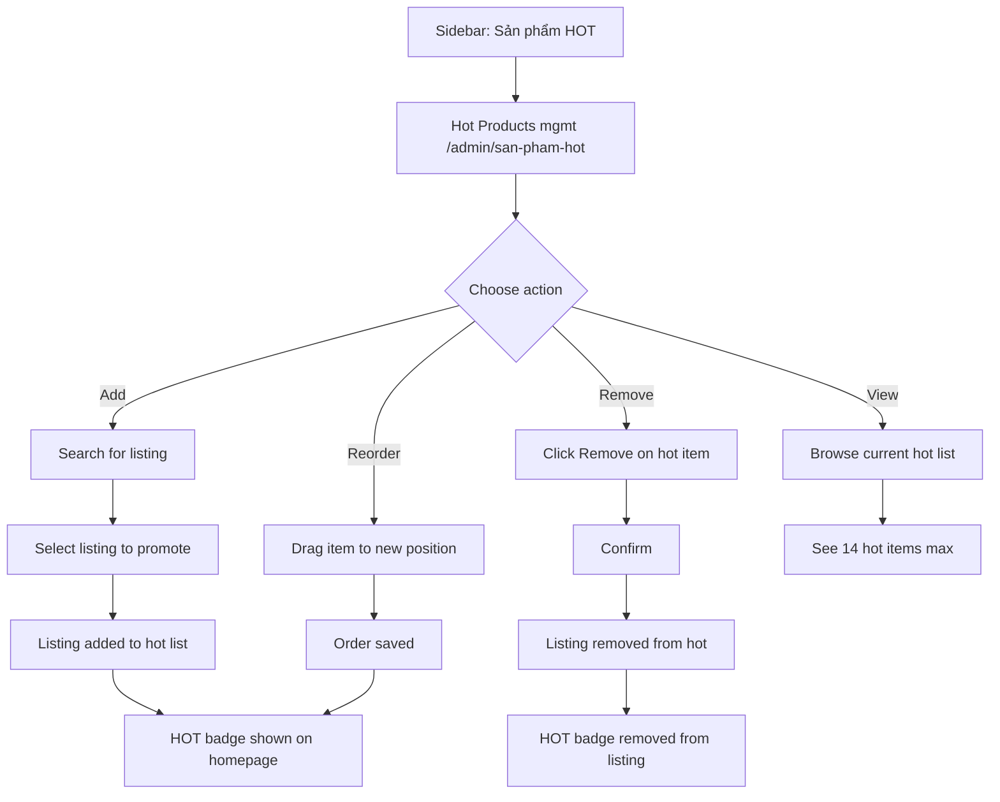

# Hot Products Curation

## Goal

Admin promotes listings to "HOT" status and manages their display order.

## Trigger

Admin navigates to Hot Products from sidebar.

## Preconditions

- User is logged in as Admin

## Main Flow

## Alternative Flows

- **Max limit**: Warn if hot list is full when adding
- **Listing not found**: No results in search

## Screen References

- SC-011 Hot Products Management
- SC-002 Shared Cart Home (HOT badge display)

## Story References

- Hot Products US-001 (promote to hot), US-002 (manage hot list)
