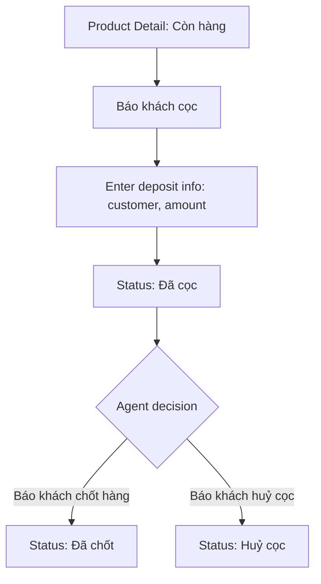
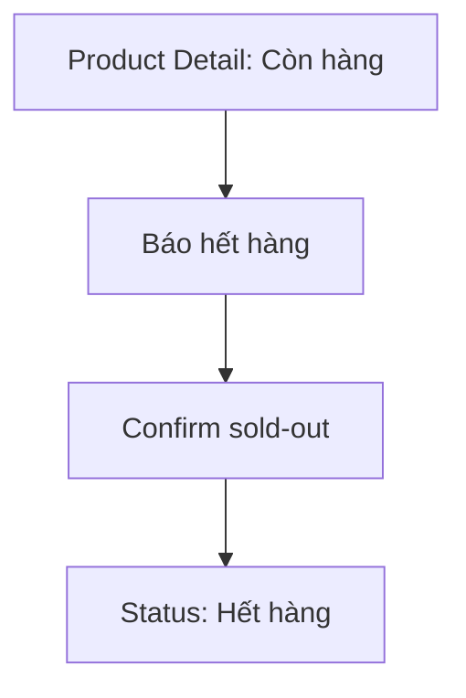

# Listing Lifecycle (Sales Role)

## Goal

Manage a listing through its deal lifecycle: report deposit, confirm closure, cancel deposit, or mark sold-out.

## Trigger

Agent views any listing on the Product Detail page where they have action permissions.

## Preconditions

- User is logged in with Sales/Agent role
- Listing is visible (own or public listing)

## Main Flow: Deposit → Closure

## Main Flow: Sold-Out

## Action Button States

| Listing Status | Báo khách cọc | Báo hết hàng | Báo khách chốt hàng | Báo khách huỷ cọc |
|---------------|:---:|:---:|:---:|:---:|
| Còn hàng | Enabled | Enabled | Disabled | Disabled |
| Đã cọc | Disabled | Disabled | Enabled | Enabled |
| Hết hàng | Disabled | Disabled | Disabled | Disabled |
| Đã chốt | Disabled | Disabled | Disabled | Disabled |
| Huỷ cọc | Disabled | Disabled | Disabled | Disabled |

## Screen References

- SC-003 Product Detail

## Story References

- Deposit/Deal Lifecycle US-001 (report deposit), US-003 (report closure), US-004 (report cancellation), US-006 (mark sold-out)
