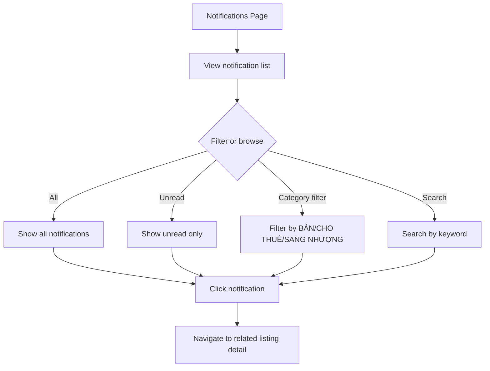

# Browse Notifications

## Goal

View and filter system notifications about deal events and listing status changes.

## Trigger

Agent clicks the notification bell (any page) or sidebar "Thông báo" link.

## Preconditions

- User is logged in

## Main Flow

## Notification Types

| Type | Format | Example |
|------|--------|---------|
| Sold-out / Expired | `[Transaction type] [User] thông báo [Product code] [đã hết]` | `[Cho thuê] [MQLAND2] thông báo [2505202624862] [đã hết]` |
| Deposit confirmed | `[Transaction type] [User] [đã chốt cọc] thành công [Product code]` | `[Sang nhượng] [Biglands] [đã chốt cọc] thành công [3105202632183]` |
| Deal closed | `[Transaction type] [User] [đã chốt hàng] thành công [Product code]` | `[Sang nhượng] [Biglands] [đã chốt hàng] thành công [0706202658118]` |

## Timestamp Formats

- "vài giây trước" (a few seconds ago)
- "N giờ trước" (N hours ago)
- "một ngày trước" (1 day ago)
- "N ngày trước" (N days ago)

## Screen References

- SC-007 Notifications

## Story References

- Notification System US-001 (receive), US-002 (mark read)
